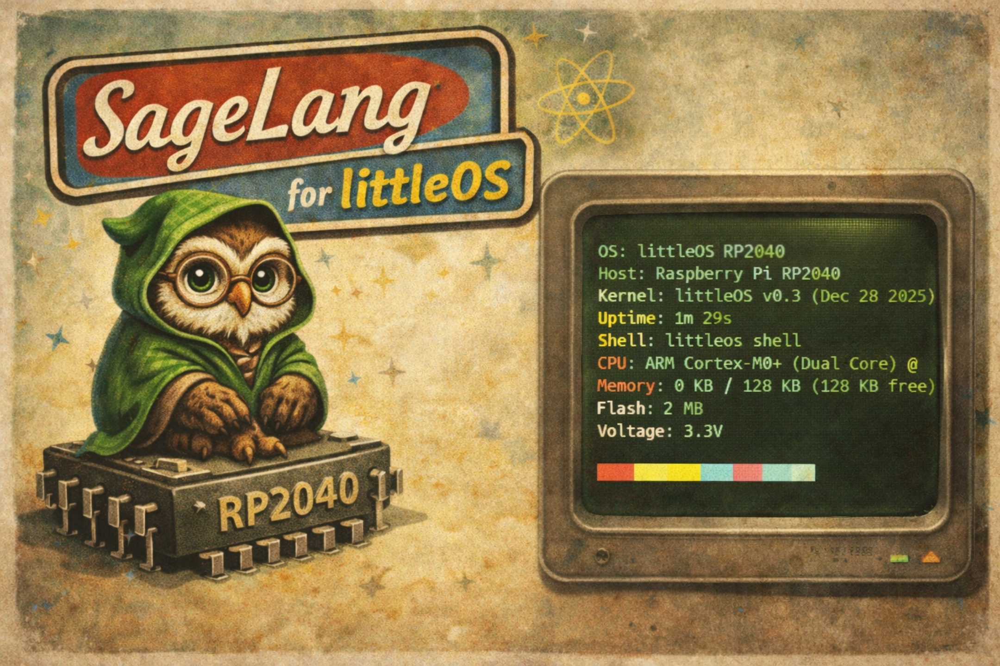

# Sage

**A clean, indentation-based systems programming language built in C.**



Sage is a new programming language that combines the readability of Python (indentation blocks, clean syntax) with the low-level power of C. It is currently in the **advanced development phase**, with a fully working interpreter featuring **Object-Oriented Programming**, **Exception Handling**, **Generators**, **Garbage Collection**, and rich data structures.

## 🚀 Features (Implemented)

### Core Language
- **Indentation-based syntax**: No braces `{}` for blocks; just clean, consistent indentation
- **Type System**: Support for **Integers**, **Strings**, **Booleans**, **Nil**, **Arrays**, **Dictionaries**, **Tuples**, **Classes**, **Instances**, **Exceptions**, and **Generators**
- **Functions**: Define functions with `proc name(args):` with full recursion, closures, and first-class function support
- **Control Flow**: `if`/`else`, `while`, `for` loops, `break`, `continue`, and **exception handling**
- **Operators**: Arithmetic (`+`, `-`, `*`, `/`), comparison (`==`, `!=`, `>`, `<`, `>=`, `<=`), logical (`and`, `or`), unary (`-`)

### Exception Handling ✅
- **Try/Catch/Finally**: Full exception handling with `try:`, `catch e:`, and `finally:`
- **Raise Statements**: Throw exceptions with `raise "error message"`
- **Exception Propagation**: Exceptions bubble through function calls
- **Finally Blocks**: Cleanup code that always executes
- **Nested Exceptions**: Catch and re-raise in nested try blocks
- **Type Safety**: Exception type with message field

### Generators & Lazy Evaluation ✅
- **`yield` statements**: Create generator functions for lazy evaluation
- **Iterator protocol**: Use `next(generator)` to get values on-demand
- **Infinite sequences**: Generators can produce unlimited values
- **State preservation**: Generator state persists between `next()` calls
- **Memory efficient**: Only compute values when needed
- **Generator functions**: Automatically detected via `yield` keyword

### Object-Oriented Programming ✅
- **Classes**: `class ClassName:` with full inheritance support
- **Constructors**: `init(self, ...)` method for initialization
- **Methods**: Functions with automatic `self` binding
- **Properties**: Dynamic instance variables via `self.property`
- **Inheritance**: `class Child(Parent):` with method overriding
- **Property Access**: `obj.property` and `obj.property = value`

### Advanced Data Structures
- **Arrays**: Dynamic lists with `push()`, `pop()`, `len()`, and slicing `arr[start:end]`
- **Dictionaries**: Hash maps with `{"key": value}` syntax
- **Tuples**: Immutable sequences `(val1, val2, val3)`
- **Array Slicing**: Pythonic slice syntax for arrays

### Memory Management
- **Garbage Collection**: Automatic mark-and-sweep GC
- **GC Control**: `gc_collect()`, `gc_enable()`, `gc_disable()`
- **Statistics**: `gc_stats()` for memory monitoring
- **Safe**: Prevents use-after-free and memory leaks

### String Operations
- **Methods**: `split()`, `join()`, `replace()`, `upper()`, `lower()`, `strip()`
- **Concatenation**: `"Hello" + " World"`
- **Indexing**: Access individual characters
- **Conversion**: `str()` function for number-to-string conversion

### Standard Library (30+ Native Functions)
- **Core**: `print()`, `input()`, `clock()`, `tonumber()`, `str()`, `len()`
- **Arrays**: `push()`, `pop()`, `range()`, `slice()`
- **Strings**: `split()`, `join()`, `replace()`, `upper()`, `lower()`, `strip()`
- **Dictionaries**: `dict_keys()`, `dict_values()`, `dict_has()`, `dict_delete()`
- **GC**: `gc_collect()`, `gc_stats()`, `gc_enable()`, `gc_disable()`
- **Generators**: `next()` for iterator protocol

## 🛠 Building Sage

Sage has zero dependencies and builds with standard GCC/Clang.

### Prerequisites
- A C compiler (`gcc` or `clang`)
- `make`

### Build Steps
1. Clone the repository:
```bash
git clone https://github.com/Night-Traders-Dev/SageLang.git
cd SageLang
```

2. Compile:
```bash
make clean && make -j$(nproc)
```
This produces the `sage` executable.

3. Run examples:
```bash
./sage examples/exceptions.sage
./sage examples/generators.sage
./sage examples/phase6_classes.sage
```

## 📝 Example Code

### Generators (New! ✨)

**`examples/generators.sage`**

```sage
# Basic generator with yield
proc count_up_to(n):
    let i = 0
    while i < n:
        yield i
        i = i + 1

let gen = count_up_to(5)
print next(gen)  # 0
print next(gen)  # 1
print next(gen)  # 2
print next(gen)  # 3
print next(gen)  # 4

# Infinite Fibonacci generator
proc fibonacci():
    let a = 0
    let b = 1
    while true:
        yield a
        let temp = a + b
        a = b
        b = temp

let fib = fibonacci()
print next(fib)  # 0
print next(fib)  # 1
print next(fib)  # 1
print next(fib)  # 2
print next(fib)  # 3
print next(fib)  # 5

# Generator with parameters
proc range_step(start, end, step):
    let i = start
    while i < end:
        yield i
        i = i + step

let evens = range_step(0, 10, 2)
print next(evens)  # 0
print next(evens)  # 2
print next(evens)  # 4
```

### Exception Handling

**`examples/exceptions.sage`**

```sage
# Basic try/catch
try:
    print "Attempting risky operation"
    raise "Something went wrong!"
    print "This won't execute"
catch e:
    print "Caught: " + e

# Function exceptions
proc divide(a, b):
    if b == 0:
        raise "Division by zero!"
    return a / b

try:
    let result = divide(10, 2)
    print "Result: " + str(result)
    let bad = divide(10, 0)  # Raises exception
    print "Won't reach here"
catch e:
    print "Math error: " + e

# Finally blocks (always execute)
try:
    print "Trying..."
    raise "Error"
catch e:
    print "Caught: " + e
finally:
    print "Cleanup always runs"

# Resource cleanup pattern
proc process_file(filename):
    print "Opening: " + filename
    try:
        if filename == "bad.txt":
            raise "File not found"
        print "Processing: " + filename
    finally:
        print "Closing: " + filename
```

### Object-Oriented Programming

**`examples/phase6_classes.sage`**

```sage
# Define a class with constructor and methods
class Person:
    proc init(self, name, age):
        self.name = name
        self.age = age

    proc greet(self):
        print "Hello, my name is " + self.name
        print "I am " + str(self.age) + " years old"

    proc birthday(self):
        self.age = self.age + 1
        print "Happy birthday!"

# Create instances
let alice = Person("Alice", 30)
let bob = Person("Bob", 25)

# Call methods
alice.greet()
alice.birthday()

# Access properties
print alice.name
print alice.age
```

### Inheritance

```sage
# Base class
class Animal:
    proc init(self, name):
        self.name = name

    proc speak(self):
        print "Some sound"

# Derived class with method overriding
class Dog(Animal):
    proc init(self, name, breed):
        self.name = name
        self.breed = breed

    proc speak(self):
        print "Woof! Woof!"

    proc info(self):
        print self.name + " is a " + self.breed

let dog = Dog("Rex", "Golden Retriever")
dog.speak()  # Prints "Woof! Woof!"
dog.info()
```

### Advanced Data Structures

```sage
# Arrays with methods
let numbers = [1, 2, 3, 4, 5]
push(numbers, 6)
print numbers[0:3]  # [1, 2, 3]
print len(numbers)   # 6

# Dictionaries
let person = {"name": "Alice", "age": "30"}
print person["name"]
person["city"] = "NYC"

let keys = dict_keys(person)
print keys  # ["name", "age", "city"]

# Tuples
let point = (10, 20, 30)
print point[0]  # 10
```

### Memory Management

```sage
# Get GC statistics
let stats = gc_stats()
print stats["bytes_allocated"]
print stats["num_objects"]
print stats["collections"]

# Manual garbage collection
gc_collect()

# Disable GC for performance-critical section
gc_disable()
# ... intensive computation ...
gc_enable()
```

## 🗺 Roadmap (Summary)

- [x] **Phase 1: Core Logic** (Lexer, Parser, Interpreter, Variables, Loops)
- [x] **Phase 2: Functions** (`proc` definitions, calls, recursion, closures)
- [x] **Phase 3: Types & Stdlib** (Strings, Booleans, Native Functions)
- [x] **Phase 4: Memory Management** (Mark-and-Sweep Garbage Collection)
- [x] **Phase 5: Advanced Data Structures** (Arrays, Dictionaries, Tuples, Slicing)
- [x] **Phase 6: Object-Oriented Programming** (Classes, Inheritance, Methods) ✅
- [x] **Phase 7: Control Flow** (for, break, continue, exceptions, generators) ✅ **100% COMPLETE**
- [ ] **Phase 8: Modules & Packages** (Imports, Package Manager) 🔄 **IN PROGRESS (60%)**
  - [x] Import statement parsing (`import`, `from...import`)
  - [x] Module loader infrastructure  
  - [x] Module caching system
  - [x] Function closure support for exports
  - [ ] Complete module execution pipeline 🚧
  - [ ] Symbol export/import resolution 🚧
  - [ ] Standard library modules
- [ ] **Phase 9: Low-Level Programming** ⭐ *Planned*
  - Inline assembly (x86-64, ARM, RISC-V)
  - Pointer arithmetic and raw memory access
  - FFI (Foreign Function Interface)
  - Bit manipulation
- [ ] **Phase 10: Compiler Development** (C/LLVM IR codegen)
- [ ] **Phase 11: Concurrency** (Threads, Async/Await)
- [ ] **Phase 12: Tooling** (LSP, Formatter, Debugger, REPL)
- [ ] **Phase 13: Self-Hosting** (Rewrite compiler in Sage)

**📝 For a detailed breakdown of all planned features, see [ROADMAP.md](ROADMAP.md)**

## 🎯 Vision

Sage aims to be a **systems programming language** that:
- Maintains clean, readable syntax (like Python)
- Provides low-level control (like C/Rust)
- Supports modern OOP with classes and inheritance
- Has robust exception handling for error management
- Enables lazy evaluation with generators
- Enables inline assembly for performance-critical code
- Compiles to native code via C or LLVM
- Eventually becomes self-hosted

### Future Capabilities

**Module System (In Progress):**
```sage
# Import modules
import math
from math import sqrt, pow

# Use imported functions
let result = sqrt(16.0)  # 4.0
let power = pow(2, 8)    # 256
```

**Low-Level Programming:**
```sage
# Inline assembly
proc fast_multiply(a: i64, b: i64) -> i64:
    let result: i64
    asm:
        "mov rax, {a}"
        "imul {b}"
        "mov {result}, rax"
        : "=r"(result)
        : "r"(a), "r"(b)
        : "rax", "rdx"
    return result

# Pointer operations
proc write_memory(ptr: *mut u8, value: u8):
    unsafe:
        *ptr = value
```

## 📊 Project Stats

- **Language**: C
- **Lines of Code**: ~55,000+
- **Phases Completed**: 7/13 (54%)
- **Phase 8 Progress**: 60% (Module system infrastructure complete, execution pipeline in progress)
- **Status**: Advanced Development
- **License**: MIT
- **Current Version**: v0.8.0-dev

## 💾 Project Structure

```
sage/
├── include/          # Header files
│   ├── ast.h         # AST nodes (classes, methods, exceptions, generators, imports)
│   ├── lexer.h       # Tokenization
│   ├── parser.h      # Syntax analysis
│   ├── env.h         # Scope management
│   ├── value.h       # Type system (FunctionValue with closures)
│   ├── gc.h          # Garbage collection
│   ├── module.h      # Module system (Phase 8)
│   └── interpreter.h # Evaluator (ExecResult with exceptions & yield)
├── src/              # C implementation
│   ├── main.c        # Entry point
│   ├── lexer.c       # Tokenizer (import keywords)
│   ├── parser.c      # Parser (import statements)
│   ├── ast.c         # AST constructors
│   ├── env.c         # Environment management
│   ├── value.c       # Values (FunctionValue closures)
│   ├── gc.c          # Mark-and-sweep GC
│   ├── module.c      # Module loading and caching
│   └── interpreter.c # Evaluator (exception propagation, yield, imports)
├── lib/              # Standard library modules
│   ├── math.sage     # Mathematical functions (in development)
│   └── (more planned)
├── examples/         # Example programs
│   ├── generators.sage      # Generator demo ✨
│   ├── exceptions.sage      # Exception handling demo
│   ├── phase6_classes.sage  # OOP demonstration
│   ├── phase5_data.sage     # Data structures
│   └── phase4_gc_demo.sage  # GC examples
├── testing/          # Test files
│   ├── test.sage     # Import testing
│   └── math.sage     # Test module
├── ROADMAP.md        # Detailed development roadmap
├── Makefile          # Build script
└── README.md         # This file
```

## 🤝 Contributing

Sage is an educational project aimed at understanding compiler construction and language design. Contributions are welcome!

### Current Focus Areas (Phase 8 - 60% Complete)
1. **Module Execution Pipeline**: Fix function export/import closure handling
2. **Symbol Resolution**: Complete environment isolation for modules
3. **Standard Library**: Building out `lib/` modules (math, io, collections)
4. **Testing**: Write comprehensive test cases for module imports
5. **Bug Fixes**: Resolve module loading edge cases

### How to Contribute
1. Fork the project
2. Create your feature branch (`git checkout -b feature/AmazingFeature`)
3. Commit your changes (`git commit -m 'Add some AmazingFeature'`)
4. Push to the branch (`git push origin feature/AmazingFeature`)
5. Open a Pull Request

### Development Guidelines
- Follow the existing code style
- Add comments for complex logic
- Update documentation for new features
- Write example code demonstrating new features
- Check the [ROADMAP.md](ROADMAP.md) for planned features

## 🔗 Resources

- **Repository**: [github.com/Night-Traders-Dev/SageLang](https://github.com/Night-Traders-Dev/SageLang)
- **Detailed Roadmap**: [ROADMAP.md](ROADMAP.md)
- **Issues**: [GitHub Issues](https://github.com/Night-Traders-Dev/SageLang/issues)
- **Discussions**: [GitHub Discussions](https://github.com/Night-Traders-Dev/SageLang/discussions)

## 📜 License

Distributed under the MIT License. See `LICENSE` for more information.

---

**Built with ❤️ for systems programming enthusiasts**

**Recent Milestones:**
- ✅ December 28, 2025: Phase 8 60% - Function closure support added, module infrastructure complete
- ✅ December 1, 2025: Phase 8 Started - Module system implementation in progress
- ✅ November 29, 2025, 3:00 PM: Phase 7 Complete - Generators with yield/next fully working
- ✅ November 28, 2025, 11:30 AM: Exception Handling Complete - try/catch/finally/raise
- ✅ November 28, 2025, 9:00 AM: Phase 6 Complete - Object-Oriented Programming
- ✅ November 27, 2025: Phase 5 Complete - Advanced Data Structures
- ✅ November 27, 2025: Phase 4 Complete - Garbage Collection
