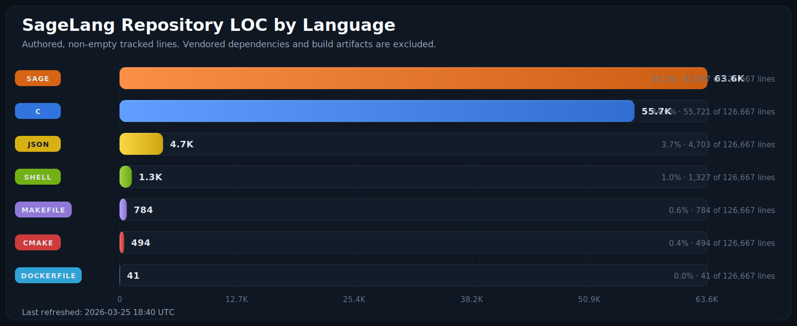
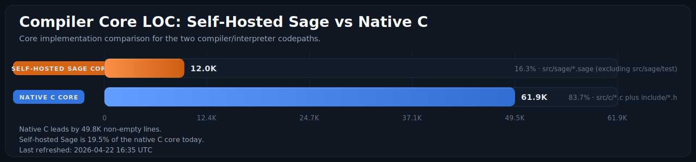
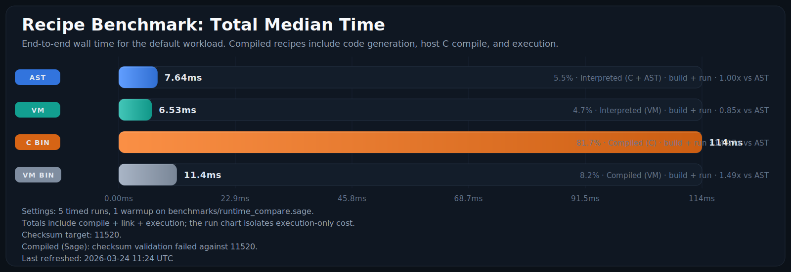
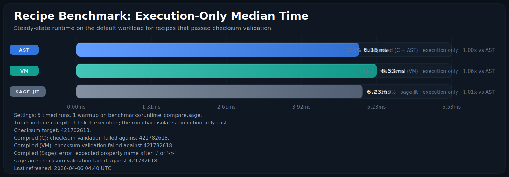

# Sage

**A clean, indentation-based systems programming language built in C.**


Sage is a new programming language that combines the readability of Python (indentation blocks, clean syntax) with the low-level power of C. It features a fully working interpreter with **Object-Oriented Programming**, **Exception Handling**, **Generators**, **Garbage Collection**, **Concurrency** (threads + async/await), a **native standard library**, three compiler backends (C, LLVM IR with runtime library, native assembly), and a **self-hosted interpreter** written in Sage itself, and a **Vulkan graphics library** for GPU compute and rendering.

## Codebase Metrics

These charts are refreshed by `make charts` and also as part of the default `make` build. They count authored, non-empty tracked lines and exclude vendored dependencies plus generated build artifacts.





## Benchmark Metrics

These charts are also refreshed by `make charts`. They are generated from `python3 scripts/benchmark_recipes.py --runs 5 --warmups 1` against `benchmarks/runtime_compare.sage`, so the absolute timings are machine-specific while the relative shape is the useful signal.

The compiled VM recipe is now charted as a first-class lane on the default workload. Any recipe that still fails or misses checksum validation is called out in the chart footers instead of being drawn as a misleading bar.





## 🚀 Features (Implemented)

### Core Language
- **Indentation-based syntax**: No braces `{}` for blocks; just clean, consistent indentation
- **Type System**: Support for **Integers**, **Strings**, **Booleans**, **Nil**, **Arrays**, **Dictionaries**, **Tuples**, **Classes**, **Instances**, **Exceptions**, and **Generators**
- **Functions**: Define functions with `proc name(args):` with full recursion, closures, and first-class function support
- **Control Flow**: `if`/`else`, `while`, `for` loops, `break`, `continue`, and **exception handling**
- **Operators**: Arithmetic (`+`, `-`, `*`, `/`), comparison (`==`, `!=`, `>`, `<`, `>=`, `<=`), logical (`and`, `or`), bitwise (`&`, `|`, `^`, `~`, `<<`, `>>`), unary (`-`)

### Exception Handling ✅
- **Try/Catch/Finally**: Full exception handling with `try:`, `catch e:`, and `finally:`
- **Raise Statements**: Throw exceptions with `raise "error message"`
- **Exception Propagation**: Exceptions bubble through function calls
- **Finally Blocks**: Cleanup code that always executes
- **Nested Exceptions**: Catch and re-raise in nested try blocks
- **Type Safety**: Exception type with message field

### Generators & Lazy Evaluation ✅
- **`yield` statements**: Create generator functions for lazy evaluation
- **Iterator protocol**: Use `next(generator)` to get values on-demand
- **Infinite sequences**: Generators can produce unlimited values
- **State preservation**: Generator state persists between `next()` calls
- **Memory efficient**: Only compute values when needed
- **Generator functions**: Automatically detected via `yield` keyword

### Object-Oriented Programming ✅
- **Classes**: `class ClassName:` with full inheritance support
- **Constructors**: `init(self, ...)` method for initialization
- **Methods**: Functions with automatic `self` binding
- **Properties**: Dynamic instance variables via `self.property`
- **Inheritance**: `class Child(Parent):` with method overriding
- **Property Access**: `obj.property` and `obj.property = value`

### Advanced Data Structures
- **Arrays**: Dynamic lists with `push()`, `pop()`, `len()`, and slicing `arr[start:end]`
- **Dictionaries**: Hash maps with `{"key": value}` syntax
- **Tuples**: Immutable sequences `(val1, val2, val3)`
- **Array Slicing**: Pythonic slice syntax for arrays

### Memory Management
- **Garbage Collection**: Automatic mark-and-sweep GC with thread-safe allocation
- **GC Control**: `gc_collect()`, `gc_enable()`, `gc_disable()`
- **Statistics**: `gc_stats()` for memory monitoring
- **Safe**: Prevents use-after-free and memory leaks

### Security Hardening
- **Type-safe value access**: All native functions validate argument types before accessing union members
- **Recursion depth limits**: Both expression evaluator and statement interpreter guard against stack overflow (max 1000)
- **Loop iteration limits**: While loops capped at 1M iterations; loop nesting capped at 64 levels
- **Buffer safety**: String literals capped at 4096 chars, identifiers at 1024 chars; all allocation via abort-on-OOM wrappers
- **Shell injection prevention**: Assembly exec/compile paths validate paths and use secure temp files (`mkstemps`)
- **SSL handle safety**: Opaque pointers stored as `VAL_POINTER` (not truncated doubles); double-free prevention via handle nullification
- **Thread safety**: GC mutex protects allocation and collection; thread-local recursion depth tracking
- **Signed arithmetic**: String replace and repeat operations use signed math to prevent unsigned underflow/overflow

### String Operations
- **Methods**: `split()`, `join()`, `replace()`, `upper()`, `lower()`, `strip()`
- **Concatenation**: `"Hello" + " World"`
- **Indexing**: Access individual characters
- **Conversion**: `str()` function for number-to-string conversion

### Standard Library (35+ Native Functions)
- **Core**: `print()`, `input()`, `clock()`, `tonumber()`, `str()`, `len()`
- **Arrays**: `push()`, `pop()`, `range()`, `slice()`
- **Strings**: `split()`, `join()`, `replace()`, `upper()`, `lower()`, `strip()`
- **Dictionaries**: `dict_keys()`, `dict_values()`, `dict_has()`, `dict_delete()`
- **GC**: `gc_collect()`, `gc_stats()`, `gc_enable()`, `gc_disable()`
- **Generators**: `next()` for iterator protocol
- **FFI**: `ffi_open()`, `ffi_call()`, `ffi_close()`, `ffi_sym()`
- **Memory**: `mem_alloc()`, `mem_free()`, `mem_read()`, `mem_write()`, `mem_size()`, `addressof()`
- **Assembly**: `asm_exec()`, `asm_compile()`, `asm_arch()` (x86-64, aarch64, rv64)
- **Structs**: `struct_def()`, `struct_new()`, `struct_get()`, `struct_set()`, `struct_size()`

### Concurrency & Async/Await

- **Threads**: `thread.spawn()`, `thread.join()`, `thread.mutex()`, `thread.lock()`, `thread.unlock()`
- **Async Procs**: `async proc name():` spawns work on a new thread when called
- **Await**: `await future` joins the thread and returns the result
- **Thread Safety**: GC mutex for safe concurrent memory management

### Native Standard Library Modules

- **`math`**: 25 functions + 5 constants (sin, cos, tan, sqrt, pow, log, floor, ceil, round, abs, pi, e, inf, tau, etc.)
- **`io`**: File operations (readfile, writefile, appendfile, exists, remove, isdir, filesize)
- **`string`**: String utilities (find, rfind, startswith, endswith, contains, char_at, ord, chr, repeat, count, substr, reverse)
- **`sys`**: System info (args, exit, getenv, clock, sleep, version, platform)
- **`thread`**: Threading primitives (spawn, join, mutex, lock, unlock, sleep, id)

### Networking Modules

- **`socket`**: Low-level POSIX sockets (create, bind, listen, accept, connect, send, recv, sendto, recvfrom, close, setopt, poll, resolve, nonblock) with constants (AF_INET, AF_INET6, SOCK_STREAM, SOCK_DGRAM, SOCK_RAW, IPPROTO_TCP, IPPROTO_UDP)
- **`tcp`**: High-level TCP (connect, listen, accept, send, recv, sendall, recvall, recvline, close)
- **`http`**: HTTP/HTTPS client via libcurl (get, post, put, delete, patch, head, download, escape, unescape) — returns `{status, body, headers}` dicts with options for timeout, redirects, SSL verification, custom headers
- **`ssl`**: OpenSSL bindings (context, load_cert, wrap, connect, accept, send, recv, shutdown, free, free_context, error, peer_cert, set_verify)

### GPU Graphics Library (Vulkan)

- **`gpu`**: Full Vulkan backend with handle-based resource management
  - Context: `gpu.initialize(name, validation?)`, `gpu.shutdown()`, `gpu.device_name()`, `gpu.device_limits()`
  - Buffers: `gpu.create_buffer()`, `gpu.buffer_upload()`, `gpu.buffer_download()`, `gpu.destroy_buffer()`
  - Images: `gpu.create_image()` (1D/2D/3D, 13 formats), auto image view creation
  - Samplers: `gpu.create_sampler()` with filter and address mode control
  - Shaders: `gpu.load_shader()` for SPIR-V modules
  - Descriptors: layout creation, pool allocation, buffer/image/sampler binding
  - Compute pipelines: `gpu.create_compute_pipeline()`, `gpu.cmd_dispatch()`
  - Graphics pipelines: full config (vertex input, rasterization, blend, depth, topology)
  - Render passes & framebuffers: attachment config with auto depth detection
  - Commands: record, bind, dispatch, draw, barriers, copy operations
  - Synchronization: fences, semaphores, queue submission (graphics + compute)
  - 100+ Vulkan enum constants exported
  - Auto-detected via pkg-config; compiles as stubs without Vulkan SDK
- **`lib/vulkan.sage`**: Ergonomic builder API — `vulkan.buffer("storage")`, `vulkan.shader("compute.spv", "compute")`
- **`lib/gpu.sage`**: High-level helpers — `run_compute()` for one-shot GPU compute, ping-pong buffers, device info

### JSON Library (cJSON Port)

- **`lib/json.sage`**: Complete 1:1 port of Dave Gamble's [cJSON](https://github.com/DaveGamble/cJSON) library (~1,050 lines)
- Full API: `cJSON_Parse`, `cJSON_Print`, `cJSON_PrintUnformatted`, `cJSON_Create*`, `cJSON_Get*`, `cJSON_Is*`, `cJSON_Add*ToObject`, `cJSON_Duplicate`, `cJSON_Compare`, `cJSON_Minify`
- Array/object manipulation: insert, detach, delete, replace items
- Sage-native conversion: `cJSON_ToSage` (tree→native dict/array), `cJSON_FromSage` (native→tree)
- 88 tests passing

Example:
```sage
import math
print math.sqrt(16)    # 4
print math.pi          # 3.14159...

import http
let resp = http.get("https://example.com")
print resp["status"]   # 200

from json import cJSON_Parse, cJSON_Print, cJSON_ToSage
let root = cJSON_Parse(resp["body"])
let native = cJSON_ToSage(root)

async proc compute(x):
    return x * x

let future = compute(42)
print await future     # 1764

import gpu
gpu.initialize("My App", true)
print gpu.device_name()
let buf = gpu.create_buffer(1024, gpu.BUFFER_STORAGE, gpu.MEMORY_HOST_VISIBLE | gpu.MEMORY_HOST_COHERENT)
gpu.buffer_upload(buf, [1.0, 2.0, 3.0, 4.0])
gpu.shutdown()
```

### Developer Tooling

- **REPL**: `sage` (no args) or `sage --repl` for interactive development with multi-line blocks, error recovery, and built-in commands such as `:help`, `:vars`, `:type`, `:load`, `:reset`, `:pwd`, `:cd`, and `:gc`
- **Formatter**: `sage fmt <file>` formats in place, `sage fmt --check <file>` checks without modifying
- **Linter**: `sage lint <file>` with 13 rules (E001-E003 errors, W001-W005 warnings, S001-S005 style)
- **Syntax Highlighting**: TextMate grammar (`editors/sage.tmLanguage.json`), VSCode extension (`editors/vscode/`)
- **LSP Server**: `sage --lsp` or standalone `sage-lsp` binary with diagnostics, completion, hover, formatting

### Self-Hosting / Bootstrap

Sage can run Sage programs through a self-hosted interpreter written entirely in SageLang. The lexer, parser, and interpreter have been ported from C to Sage (~1,920 lines total).

```bash
cd src/sage && ../../sage sage.sage program.sage
```

- **Lexer** (`lexer.sage`, ~300 lines) - Indentation-aware tokenizer with dict-based keyword lookup
- **Parser** (`parser.sage`, ~700 lines) - Recursive descent with 12 precedence levels
- **Interpreter** (`interpreter.sage`, ~920 lines) - Tree-walking evaluator with dict-based values
- **Bootstrap coverage**: arithmetic, variables, control flow, functions, recursion, closures, classes, inheritance, arrays, dicts, strings, try/catch, break/continue
- **Self-hosted test suites**: lexer, parser, interpreter, bootstrap, formatter, linter, value, optimization passes, stdlib, module loading, codegen, compiler, LSP, and CLI coverage
- GC must be disabled for self-hosted code (`gc_disable()`)

### Bundled `lib/` Modules
- **`math`**: arithmetic helpers, `pow_int`, `factorial`, `gcd`, `lcm`, `sqrt`, distance helpers
- **`arrays`**: `map`, `filter`, `reduce`, `unique`, `zip`, `chunk`, `flatten`, `concat`
- **`strings`**: whitespace cleanup, `contains`, substring counting, padding, case formatting helpers
- **`dicts`**: query-oriented helpers for dictionary size, fallback reads, entries, and key checks
- **`iter`**: reusable generators such as `count`, `range_step`, `enumerate_array`, `cycle`, and `take`
- **`stats`**: `mean`, `variance`, `stddev`, `cumulative`, and normalization helpers
- **`assert`**: assertion helpers for writing Sage test scripts
- **`utils`**: general helpers like `default_if_nil`, `swap`, `head`, `last`, and `repeat_value`
- **`json`**: Complete 1:1 cJSON port — parse, print, create, query, modify JSON trees (88 tests)
- **`vulkan`**: Ergonomic Vulkan builder API (string-based buffer/shader/pipeline creation, barrier helpers)
- **`gpu`**: High-level GPU compute helpers (one-shot compute dispatch, ping-pong buffers, device info)

Example:
```sage
from math import factorial
import arrays as arr

proc double(x):
    return x * 2

print factorial(5)
print arr.map([1, 2, 3], double)
```

## 🛠 Building Sage

Sage’s desktop build links against `libm`, `pthread`, `dl`, `libcurl`, and OpenSSL. The project supports three build paths:

- Desktop C build: produces `sage` and `sage-lsp`
- Self-hosted bootstrap flow: uses the C interpreter to run `src/sage/sage.sage`
- Pico/RP2040 build: via CMake and the Pico SDK

### Prerequisites
- A C compiler such as `gcc`, `clang`, or `cc`
- `make` and/or `cmake`
- Desktop libraries and headers for `libcurl` and OpenSSL
- For Pico builds: a valid `PICO_SDK_PATH`

### Build from C (Default)

```bash
git clone https://github.com/Night-Traders-Dev/SageLang.git
cd SageLang
make clean && make -j$(nproc)
```
This produces `./sage` and `./sage-lsp`.

Run examples:
```bash
./sage examples/exceptions.sage
./sage examples/generators.sage
./sage examples/phase6_classes.sage
```

### Self-Hosted Build (Sage-on-Sage)

The self-hosted flow still builds the C `sage` executable first, then uses it to execute the Sage bootstrap sources under `src/sage/`:

```bash
make sage-boot FILE=examples/hello.sage
make test-selfhost
make test-selfhost-lexer
make test-selfhost-parser
make test-selfhost-interpreter
make test-selfhost-bootstrap
make test-selfhost-formatter
make test-selfhost-linter
make test-selfhost-value
make test-selfhost-pass
make test-selfhost-constfold
make test-selfhost-dce
make test-selfhost-inline
make test-selfhost-typecheck
make test-selfhost-stdlib
make test-selfhost-module
make test-selfhost-llvm-backend
make test-selfhost-codegen
make test-selfhost-compiler
make test-selfhost-errors
make test-selfhost-lsp
make test-selfhost-sage-cli
make test-all
```

### CMake Build

CMake supports the same two modes via build options:

```bash
# Default: build sage and sage-lsp from C
cmake -B build && cmake --build build

# Self-hosted mode: build sage, then run self-hosted targets
cmake -B build -DBUILD_SAGE=ON && cmake --build build
cmake --build build --target test_selfhost

# Pico/RP2040 build
cmake -B build_pico -DBUILD_PICO=ON -DPICO_BOARD=pico
cmake --build build_pico
```

When `BUILD_SAGE=ON`, the executable target is still `sage`; the build adds the custom bootstrap targets such as `sage_boot` and `test_selfhost`.

Convenience Make targets for CMake:
```bash
make cmake                 # Configure a desktop CMake build
make cmake-build           # Build the desktop CMake tree
make cmake-sage            # Setup CMake self-hosted build
make cmake-sage-build      # Build and run self-hosted tests via CMake
make cmake-pico            # Setup a Pico CMake build
```

### Build Parameters

#### Make Variables

| Variable | Default | Effect |
| -------- | ------- | ------ |
| `CC` | `gcc` | C compiler used for `make` builds |
| `CFLAGS` | `-std=c11 -Wall -Wextra -Wpedantic -O2 -D_POSIX_C_SOURCE=200809L` | Base compile flags for the desktop build |
| `LDFLAGS` | `-lm -lpthread -ldl -lcurl -lssl -lcrypto` | Desktop link flags; `-lvulkan` added when Vulkan SDK detected; switches to `-lm` when `PICO_BUILD` is set |
| `VULKAN` | `auto` | `auto` detects via pkg-config, `1` forces Vulkan, `0` disables |
| `DEBUG` | `0` | `DEBUG=1` adds `-g -O0 -DDEBUG` |
| `PREFIX` | `/usr/local` | Install prefix for `make install` |
| `FILE` | unset | Required by `make sage-boot FILE=<path>` |
| `PICO_BUILD` | unset | Internal Make switch that changes link flags for non-desktop builds |

#### CMake Cache Variables And Environment Inputs

| Parameter | Default | Effect |
| --------- | ------- | ------ |
| `BUILD_PICO` | `OFF` | Enables the Pico/RP2040 build and imports `pico_sdk_import.cmake` before `project()` |
| `BUILD_SAGE` | `OFF` | Enables bootstrap/self-hosted build targets such as `sage_boot` and `test_selfhost` |
| `ENABLE_DEBUG` | `OFF` | Adds `-g -O0 -DDEBUG` |
| `ENABLE_TESTS` | `OFF` | Builds optional C test executables and enables `ctest` targets |
| `CMAKE_BUILD_TYPE` | generator default | Standard CMake build type summary field |
| `CMAKE_C_COMPILER` | toolchain default | Chooses the C compiler shown in the config summary |
| `CMAKE_INSTALL_PREFIX` | CMake default | Install destination for `cmake --install` |
| `PICO_SDK_PATH` | unset | Required for Pico builds unless your environment already exports it |
| `PICO_BOARD` | `pico` | Pico board name used by Pico SDK builds |
| `SAGE_FILE` | unset | Input file consumed by the `sage_boot` custom target in self-hosted builds |

### `sage` Parameter Reference

#### Top-Level Invocations

| Command | Meaning | Notes |
| ------- | ------- | ----- |
| `sage` | Start the interactive REPL | Same as `sage --repl` |
| `sage --repl` | Start the interactive REPL | Multi-line blocks are supported |
| `sage --help` | Print CLI usage | Shows compiler, tooling, and REPL entry points |
| `sage -c "source"` | Execute a source string | Runs without loading a file |
| `sage <file.sage> [arg ...]` | Run a Sage source file | Extra arguments are available through `sys.args()` |
| `sage --lsp` | Start the LSP server on stdin/stdout | `sage-lsp` is the standalone companion binary |
| `sage fmt <file>` | Format a file in place | Prints `Formatted: <file>` on success |
| `sage fmt --check <file>` | Check formatting without rewriting | Exit code `1` when formatting is needed |
| `sage lint <file>` | Run the static linter | Exit code `1` when issues are found |

#### Compiler And Codegen Commands

| Command | Output Default | Supported Options |
| ------- | -------------- | ----------------- |
| `sage --emit-c <input.sage>` | `<input>.c` | `-o <path>`, `-O0`, `-O1`, `-O2`, `-O3`, `-g` |
| `sage --compile <input.sage>` | `<input-without-.sage>` | `-o <path>`, `--cc <compiler>`, `-O0`, `-O1`, `-O2`, `-O3`, `-g` |
| `sage --emit-llvm <input.sage>` | `<input>.ll` | `-o <path>`, `-O0`, `-O1`, `-O2`, `-O3`, `-g` |
| `sage --compile-llvm <input.sage>` | `<input-without-.sage>` | `-o <path>`, `-O0`, `-O1`, `-O2`, `-O3`, `-g` |
| `sage --emit-asm <input.sage>` | `<input>.s` | `-o <path>`, `--target <arch>`, `-O0`, `-O1`, `-O2`, `-O3`, `-g` |
| `sage --compile-native <input.sage>` | `<input-without-.sage>` | `-o <path>`, `--target <arch>`, `-O0`, `-O1`, `-O2`, `-O3`, `-g` |
| `sage --emit-pico-c <input.sage>` | `<input>.pico.c` | `-o <path>` |
| `sage --compile-pico <input.sage>` | `.tmp/<program-name>` build dir and `<program-name>.uf2` | `-o <dir>`, `--board <name>`, `--name <program>`, `--sdk <path>` |

#### Option Semantics

| Option | Applies To | Meaning |
| ------ | ---------- | ------- |
| `-o <path>` | All emit/compile commands, plus `--compile-pico` | Output file or output directory depending on command |
| `--cc <compiler>` | `--compile` | Overrides the host C compiler; defaults to `cc` |
| `--target <arch>` | `--emit-asm`, `--compile-native` | Target architecture. Accepted values: `x86-64`, `x86_64`, `aarch64`, `arm64`, `rv64`, `riscv64` |
| `-O0` / `-O1` / `-O2` / `-O3` | C, LLVM, and native codegen commands | Optimization pass level selected in `src/c/main.c` |
| `-g` | C, LLVM, asm, and native compile/emit commands | Enables debug information in the generated output path |
| `--board <name>` | `--compile-pico` | Pico board name; defaults to `pico` |
| `--name <program>` | `--compile-pico` | Program name used for generated file names; defaults to the input basename |
| `--sdk <path>` | `--compile-pico` | Pico SDK path; falls back to the `PICO_SDK_PATH` environment variable |

### REPL Commands

| Command | Meaning |
| ------- | ------- |
| `:help` | Print REPL help |
| `:quit` / `:exit` | Leave the session (also Ctrl-D) |
| `:reset` | Reset the session, global bindings, and module cache |
| `:clear` | Clear the terminal screen |
| `:history [n]` | Show last n history entries (default: 20) |
| `:save <file>` | Save session history to a Sage source file |
| `:vars [prefix]` | List current REPL bindings, optionally filtered by prefix |
| `:type <expr>` | Evaluate an expression and print its runtime type and value |
| `:ast <code>` | Show parsed AST for an expression or statement |
| `:env` | Show the full scope chain with parent environments |
| `:modules` | List loaded modules and search paths |
| `:emit-c <code>` | Show C backend output for a statement |
| `:emit-llvm <code>` | Show LLVM IR output for a statement |
| `:time <expr>` | Time a single expression evaluation |
| `:bench <n> <expr>` | Run expression n times, show min/avg/max |
| `:load <file>` | Execute a Sage file inside the current session |
| `:pwd` | Print the current working directory |
| `:cd <dir>` | Change the working directory |
| `:gc` | Run garbage collection and print GC statistics |
| `:runtime [mode]` | Show or switch runtime (ast, bytecode, auto) |

## 📝 Example Code

### Generators (New! ✨)

**`examples/generators.sage`**

```sage
# Basic generator with yield
proc count_up_to(n):
    let i = 0
    while i < n:
        yield i
        i = i + 1

let gen = count_up_to(5)
print next(gen)  # 0
print next(gen)  # 1
print next(gen)  # 2
print next(gen)  # 3
print next(gen)  # 4

# Infinite Fibonacci generator
proc fibonacci():
    let a = 0
    let b = 1
    while true:
        yield a
        let temp = a + b
        a = b
        b = temp

let fib = fibonacci()
print next(fib)  # 0
print next(fib)  # 1
print next(fib)  # 1
print next(fib)  # 2
print next(fib)  # 3
print next(fib)  # 5

# Generator with parameters
proc range_step(start, end, step):
    let i = start
    while i < end:
        yield i
        i = i + step

let evens = range_step(0, 10, 2)
print next(evens)  # 0
print next(evens)  # 2
print next(evens)  # 4
```

### Exception Handling

**`examples/exceptions.sage`**

```sage
# Basic try/catch
try:
    print "Attempting risky operation"
    raise "Something went wrong!"
    print "This won't execute"
catch e:
    print "Caught: " + e

# Function exceptions
proc divide(a, b):
    if b == 0:
        raise "Division by zero!"
    return a / b

try:
    let result = divide(10, 2)
    print "Result: " + str(result)
    let bad = divide(10, 0)  # Raises exception
    print "Won't reach here"
catch e:
    print "Math error: " + e

# Finally blocks (always execute)
try:
    print "Trying..."
    raise "Error"
catch e:
    print "Caught: " + e
finally:
    print "Cleanup always runs"

# Resource cleanup pattern
proc process_file(filename):
    print "Opening: " + filename
    try:
        if filename == "bad.txt":
            raise "File not found"
        print "Processing: " + filename
    finally:
        print "Closing: " + filename
```

### Object-Oriented Programming

**`examples/phase6_classes.sage`**

```sage
# Define a class with constructor and methods
class Person:
    proc init(self, name, age):
        self.name = name
        self.age = age

    proc greet(self):
        print "Hello, my name is " + self.name
        print "I am " + str(self.age) + " years old"

    proc birthday(self):
        self.age = self.age + 1
        print "Happy birthday!"

# Create instances
let alice = Person("Alice", 30)
let bob = Person("Bob", 25)

# Call methods
alice.greet()
alice.birthday()

# Access properties
print alice.name
print alice.age
```

### Inheritance

```sage
# Base class
class Animal:
    proc init(self, name):
        self.name = name

    proc speak(self):
        print "Some sound"

# Derived class with method overriding
class Dog(Animal):
    proc init(self, name, breed):
        self.name = name
        self.breed = breed

    proc speak(self):
        print "Woof! Woof!"

    proc info(self):
        print self.name + " is a " + self.breed

let dog = Dog("Rex", "Golden Retriever")
dog.speak()  # Prints "Woof! Woof!"
dog.info()
```

### Advanced Data Structures

```sage
# Arrays with methods
let numbers = [1, 2, 3, 4, 5]
push(numbers, 6)
print numbers[0:3]  # [1, 2, 3]
print len(numbers)   # 6

# Dictionaries
let person = {"name": "Alice", "age": "30"}
print person["name"]
person["city"] = "NYC"

let keys = dict_keys(person)
print keys  # ["name", "age", "city"]

# Tuples
let point = (10, 20, 30)
print point[0]  # 10
```

### Memory Management

```sage
# Get GC statistics
let stats = gc_stats()
print stats["bytes_allocated"]
print stats["num_objects"]
print stats["collections"]

# Manual garbage collection
gc_collect()

# Disable GC for performance-critical section
gc_disable()
# ... intensive computation ...
gc_enable()
```

## 🗺 Roadmap (Summary)

- [x] **Phase 1: Core Logic** (Lexer, Parser, Interpreter, Variables, Loops)
- [x] **Phase 2: Functions** (`proc` definitions, calls, recursion, closures)
- [x] **Phase 3: Types & Stdlib** (Strings, Booleans, Native Functions)
- [x] **Phase 4: Memory Management** (Mark-and-Sweep Garbage Collection)
- [x] **Phase 5: Advanced Data Structures** (Arrays, Dictionaries, Tuples, Slicing)
- [x] **Phase 6: Object-Oriented Programming** (Classes, Inheritance, Methods) ✅
- [x] **Phase 7: Control Flow** (for, break, continue, exceptions, generators) ✅ **100% COMPLETE**
- [x] **Phase 8: Modules & Packages** (import, from-import, import-as, module caching, path security) ✅
- [x] **Phase 8.5: Security & Performance Hardening** (recursion limits, loop iteration limits, string length limits, null-call guards, type-safe accessors, OOM safety, hash table dicts, GC env integration, test suite) ✅
- [x] **Phase 9: Low-Level Programming** ✅
  - [x] Bit manipulation (`&`, `|`, `^`, `~`, `<<`, `>>`)
  - [x] FFI (`ffi_open`, `ffi_call`, `ffi_close`, `ffi_sym`)
  - [x] Raw memory (`mem_alloc`, `mem_read`, `mem_write`, `mem_free`, `mem_size`, `addressof`)
  - [x] Inline assembly (`asm_exec`, `asm_compile`, `asm_arch` — x86-64, aarch64, rv64)
  - [x] C struct interop (`struct_def`, `struct_new`, `struct_get`, `struct_set`, `struct_size`)
- [x] **Phase 10: Compiler Development** (C backend, LLVM IR, native ASM, optimization passes) ✅
- [x] **Phase 11: Concurrency & Stdlib** (Native modules, threads, async/await, backend expansion) ✅
- [x] **Phase 12: Tooling** (REPL, Formatter, Linter, Syntax Highlighting, LSP) ✅
- [x] **Phase 13: Self-Hosting** (Lexer, parser, interpreter ported to Sage, full bootstrap) ✅
- [x] **Phase 15: Vulkan Graphics Library** (GPU module, compute/graphics pipelines, resource management, Sage-level builders) ✅
- [x] **Phase 14: Security & Performance Audit** ✅
  - [x] Thread-safe GC (mutex around allocation and collection)
  - [x] SSL handles as `VAL_POINTER` (64-bit safe, double-free prevention)
  - [x] Shell injection prevention in `asm_exec`/`asm_compile` (path validation, `mkstemps`)
  - [x] Recursion guards on both `eval_expr` and `interpret`
  - [x] Loop depth bounds checking in LLVM and native codegen backends
  - [x] Assembly injection prevention (escaped `.asciz` string emission)
  - [x] Signed arithmetic for `string_replace`/`string_repeat` (no unsigned underflow)
  - [x] Bounded recv/alloc sizes across socket, TCP, and SSL modules
  - [x] Dynamic name buffers in DCE, inlining, and type-checking passes (no 256-byte truncation)
  - [x] Constant folding guards (infinity/NaN skip, 64KB string limit)
  - [x] Print depth limit (circular reference protection)
  - [x] Correct dict iteration in `print_value` (iterate by capacity, not count)

**📝 For a detailed breakdown of all planned features, see [ROADMAP.md](ROADMAP.md)**

## 🎯 Vision

Sage aims to be a **systems programming language** that:
- Maintains clean, readable syntax (like Python)
- Provides low-level control (like C/Rust)
- Supports modern OOP with classes and inheritance
- Has robust exception handling for error management
- Enables lazy evaluation with generators
- Enables inline assembly for performance-critical code
- Compiles to native code via C, LLVM (with runtime library), or direct assembly
- Is self-hosted (Sage interpreter written in Sage)

### Future Capabilities

**Low-Level Programming:**
```sage
# Inline assembly
proc fast_multiply(a: i64, b: i64) -> i64:
    let result: i64
    asm:
        "mov rax, {a}"
        "imul {b}"
        "mov {result}, rax"
        : "=r"(result)
        : "r"(a), "r"(b)
        : "rax", "rdx"
    return result

# Pointer operations
proc write_memory(ptr: *mut u8, value: u8):
    unsafe:
        *ptr = value
```

## 📊 Project Stats

- **Language**: C
- **Phases Completed**: 15/15 (100%)
- **Test Suite**: 144 interpreter + 28 compiler + 88 JSON + 1411 self-hosted tests (1671+ total) across parsing, execution, tooling, optimization, codegen, compiler, LSP, CLI, and GPU
- **Backends**: C codegen, LLVM IR (with standalone runtime library), native assembly (x86-64, aarch64, rv64), Vulkan compute/graphics
- **Self-Hosting**: Lexer, parser, interpreter ported to Sage with full bootstrap
- **Status**: Active development with a working self-hosted interpreter and GPU graphics library
- **License**: MIT
- **Current Version**: v0.15.0-dev

## 💾 Project Structure

```
sage/
├── include/          # Header files
│   ├── ast.h         # AST nodes (classes, methods, exceptions, generators, imports)
│   ├── lexer.h       # Tokenization
│   ├── parser.h      # Syntax analysis
│   ├── env.h         # Scope management
│   ├── value.h       # Type system (FunctionValue with closures)
│   ├── gc.h          # Garbage collection
│   ├── module.h      # Module system (Phase 8)
│   ├── interpreter.h # Evaluator (ExecResult with exceptions & yield)
│   └── graphics.h    # Vulkan GPU module (handle system + API)
├── src/              # C implementation
│   ├── main.c        # Entry point
│   ├── lexer.c       # Tokenizer (keywords including async/await)
│   ├── parser.c      # Parser (all statement/expression types)
│   ├── ast.c         # AST constructors
│   ├── env.c         # Environment management
│   ├── value.c       # Values (functions, threads, mutexes)
│   ├── gc.c          # Mark-and-sweep GC (thread-safe)
│   ├── module.c      # Module loading and caching
│   ├── stdlib.c      # Native stdlib modules (math, io, string, sys, thread)
│   ├── net.c         # Networking modules (socket, tcp, http, ssl)
│   ├── interpreter.c # Evaluator (exceptions, yield, imports, async/await)
│   ├── compiler.c    # C code generation backend
│   ├── llvm_backend.c # LLVM IR generation backend
│   ├── llvm_runtime.c # LLVM standalone runtime library (40+ sage_rt_* functions)
│   ├── codegen.c     # Native assembly backend (x86-64, aarch64, rv64)
│   ├── pass.c        # Optimization pass infrastructure
│   ├── typecheck.c   # Type checking pass
│   ├── constfold.c   # Constant folding pass
│   ├── dce.c         # Dead code elimination pass
│   ├── inline.c      # Function inlining pass
│   ├── main.c        # CLI entry point and REPL implementation
│   ├── formatter.c   # Code formatter
│   ├── linter.c      # Static analysis linter
│   └── lsp.c         # Language Server Protocol server
├── editors/          # Editor integration
│   ├── sage.tmLanguage.json  # TextMate grammar
│   └── vscode/       # VSCode extension
├── lib/              # Standard library modules (Sage)
│   ├── math.sage     # Math helpers (factorial, gcd, etc.)
│   ├── arrays.sage   # Array utilities (map, filter, reduce, etc.)
│   ├── strings.sage  # String utilities
│   ├── dicts.sage    # Dictionary helpers
│   ├── iter.sage     # Reusable generators
│   ├── stats.sage    # Statistics helpers
│   ├── assert.sage   # Test assertion helpers
│   ├── utils.sage    # General utilities
│   ├── json.sage     # cJSON port (1:1 API, 88 tests)
│   ├── vulkan.sage   # Ergonomic Vulkan builder API
│   └── gpu.sage      # High-level GPU compute helpers
├── examples/         # Example programs
│   ├── generators.sage      # Generator demo ✨
│   ├── exceptions.sage      # Exception handling demo
│   ├── phase6_classes.sage  # OOP demonstration
│   ├── phase5_data.sage     # Data structures
│   └── phase4_gc_demo.sage  # GC examples
├── src/
│   ├── c/            # C implementation
│   │   ├── main.c    # Entry point
│   │   ├── lexer.c   # Tokenizer
│   │   ├── parser.c  # Recursive descent parser
│   │   ├── interpreter.c  # Tree-walking interpreter
│   │   ├── compiler.c     # C code generation backend
│   │   ├── llvm_backend.c # LLVM IR backend
│   │   │   ├── llvm_runtime.c # LLVM runtime library (40+ sage_rt_* functions)
│   │   ├── codegen.c      # Native assembly backend
│   │   ├── graphics.c     # Vulkan GPU module (compute + graphics pipelines)
│   │   └── ...            # 25 C source files total
│   └── sage/         # Self-hosted Sage compiler (Phase 13+)
│       ├── sage.sage     # Bootstrap entry point
│       ├── token.sage    # Token type definitions
│       ├── ast.sage      # AST node constructors
│       ├── lexer.sage    # Self-hosted lexer (~300 lines)
│       ├── parser.sage   # Self-hosted parser (~700 lines)
│       ├── interpreter.sage  # Self-hosted interpreter (~920 lines)
│       ├── test_lexer.sage       # Lexer tests (12)
│       ├── test_parser.sage      # Parser tests (130)
│       ├── test_interpreter.sage # Interpreter tests (18)
│       └── test_bootstrap.sage   # Bootstrap tests (18)
├── tests/            # Automated test suite (144 interpreter + 28 compiler + 88 JSON)
│   ├── run_tests.sh  # Test runner script
│   ├── test_json.sage # cJSON port test suite (88 tests)
│   ├── 01_variables/ # Variable declaration tests
│   ├── ...           # 28 test categories
│   ├── 26_stdlib/    # Standard library module tests
│   ├── 27_threads/   # Thread concurrency tests
│   └── 28_async/     # Async/await tests
├── ROADMAP.md        # Detailed development roadmap
├── UPDATES.md        # Changelog
├── Makefile          # Build script
└── README.md         # This file
```

## 🤝 Contributing

Sage is an educational project aimed at understanding compiler construction and language design. Contributions are welcome!

### Current Focus Areas

1. **Backend Expansion**: Extend LLVM and native backends for class/module/async support
2. **Package Manager**: CLI for dependency management
3. **Self-Hosted Compiler**: Extend self-hosted interpreter to emit C/LLVM/assembly
4. **Ecosystem Growth**: Standard library expansion, community building

### How to Contribute
1. Fork the project
2. Create your feature branch (`git checkout -b feature/AmazingFeature`)
3. Commit your changes (`git commit -m 'Add some AmazingFeature'`)
4. Push to the branch (`git push origin feature/AmazingFeature`)
5. Open a Pull Request

### Development Guidelines
- Follow the existing code style
- Add comments for complex logic
- Update documentation for new features
- Write example code demonstrating new features
- Check the [ROADMAP.md](ROADMAP.md) for planned features

## 🔗 Resources

- **Repository**: [github.com/Night-Traders-Dev/SageLang](https://github.com/Night-Traders-Dev/SageLang)
- **Detailed Roadmap**: [ROADMAP.md](ROADMAP.md)
- **Issues**: [GitHub Issues](https://github.com/Night-Traders-Dev/SageLang/issues)
- **Discussions**: [GitHub Discussions](https://github.com/Night-Traders-Dev/SageLang/discussions)

## 📜 License

Distributed under the MIT License. See `LICENSE` for more information.

---

**Built with ❤️ for systems programming enthusiasts**

**Recent Milestones:**

- March 18, 2026: Phase 15 Complete - Vulkan graphics library (GPU module with compute/graphics pipelines, 100+ constants, Sage builder APIs, 104 tests)
- March 17, 2026: LLVM Backend - Standalone runtime library (40+ sage_rt_* functions), ABI fix, local variable allocation, block termination tracking; --compile-llvm now produces working executables
- March 17, 2026: Phase 14 Complete - Security & performance audit (30 fixes across 14 files, all 1425 tests passing)
- March 9, 2026: Networking modules (socket, tcp, http, ssl) + cJSON port (88 tests)
- March 9, 2026: Phase 13 Complete - Self-hosted lexer, parser, interpreter with full bootstrap
- March 9, 2026: Phase 12 Complete - REPL, formatter, linter, syntax highlighting, LSP server
- March 9, 2026: Phase 11 Complete - Native stdlib, threads, async/await, backend expansion
- March 9, 2026: Phase 10 Complete - C/LLVM/native backends, optimization passes
- March 8, 2026: Phase 8.5 Complete - Security & performance hardening
- November 29, 2025: Phase 7 Complete - Generators with yield/next
- November 28, 2025: Phase 6 Complete - Object-Oriented Programming
- November 27, 2025: Phase 5 Complete - Advanced Data Structures
- November 27, 2025: Phase 4 Complete - Garbage Collection
