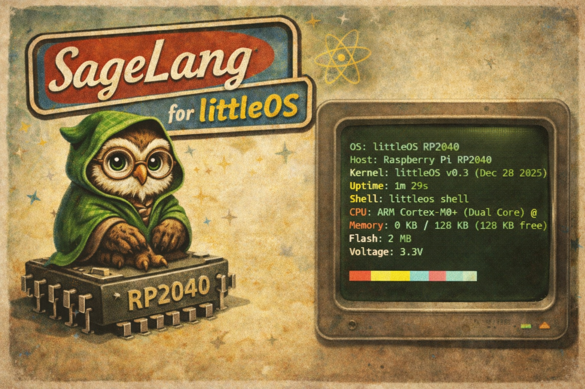

# Sage

**A clean, indentation-based systems programming language built in C.**



Sage is a new programming language that combines the readability of Python (indentation blocks, clean syntax) with the low-level power of C. It features a fully working interpreter with **Object-Oriented Programming**, **Exception Handling**, **Generators**, **Garbage Collection**, **Concurrency** (threads + async/await), a **native standard library**, three compiler backends (C, LLVM IR, native assembly), and a **self-hosted interpreter** written in Sage itself.

## 🚀 Features (Implemented)

### Core Language
- **Indentation-based syntax**: No braces `{}` for blocks; just clean, consistent indentation
- **Type System**: Support for **Integers**, **Strings**, **Booleans**, **Nil**, **Arrays**, **Dictionaries**, **Tuples**, **Classes**, **Instances**, **Exceptions**, and **Generators**
- **Functions**: Define functions with `proc name(args):` with full recursion, closures, and first-class function support
- **Control Flow**: `if`/`else`, `while`, `for` loops, `break`, `continue`, and **exception handling**
- **Operators**: Arithmetic (`+`, `-`, `*`, `/`), comparison (`==`, `!=`, `>`, `<`, `>=`, `<=`), logical (`and`, `or`), bitwise (`&`, `|`, `^`, `~`, `<<`, `>>`), unary (`-`)

### Exception Handling ✅
- **Try/Catch/Finally**: Full exception handling with `try:`, `catch e:`, and `finally:`
- **Raise Statements**: Throw exceptions with `raise "error message"`
- **Exception Propagation**: Exceptions bubble through function calls
- **Finally Blocks**: Cleanup code that always executes
- **Nested Exceptions**: Catch and re-raise in nested try blocks
- **Type Safety**: Exception type with message field

### Generators & Lazy Evaluation ✅
- **`yield` statements**: Create generator functions for lazy evaluation
- **Iterator protocol**: Use `next(generator)` to get values on-demand
- **Infinite sequences**: Generators can produce unlimited values
- **State preservation**: Generator state persists between `next()` calls
- **Memory efficient**: Only compute values when needed
- **Generator functions**: Automatically detected via `yield` keyword

### Object-Oriented Programming ✅
- **Classes**: `class ClassName:` with full inheritance support
- **Constructors**: `init(self, ...)` method for initialization
- **Methods**: Functions with automatic `self` binding
- **Properties**: Dynamic instance variables via `self.property`
- **Inheritance**: `class Child(Parent):` with method overriding
- **Property Access**: `obj.property` and `obj.property = value`

### Advanced Data Structures
- **Arrays**: Dynamic lists with `push()`, `pop()`, `len()`, and slicing `arr[start:end]`
- **Dictionaries**: Hash maps with `{"key": value}` syntax
- **Tuples**: Immutable sequences `(val1, val2, val3)`
- **Array Slicing**: Pythonic slice syntax for arrays

### Memory Management
- **Garbage Collection**: Automatic mark-and-sweep GC
- **GC Control**: `gc_collect()`, `gc_enable()`, `gc_disable()`
- **Statistics**: `gc_stats()` for memory monitoring
- **Safe**: Prevents use-after-free and memory leaks

### String Operations
- **Methods**: `split()`, `join()`, `replace()`, `upper()`, `lower()`, `strip()`
- **Concatenation**: `"Hello" + " World"`
- **Indexing**: Access individual characters
- **Conversion**: `str()` function for number-to-string conversion

### Standard Library (35+ Native Functions)
- **Core**: `print()`, `input()`, `clock()`, `tonumber()`, `str()`, `len()`
- **Arrays**: `push()`, `pop()`, `range()`, `slice()`
- **Strings**: `split()`, `join()`, `replace()`, `upper()`, `lower()`, `strip()`
- **Dictionaries**: `dict_keys()`, `dict_values()`, `dict_has()`, `dict_delete()`
- **GC**: `gc_collect()`, `gc_stats()`, `gc_enable()`, `gc_disable()`
- **Generators**: `next()` for iterator protocol
- **FFI**: `ffi_open()`, `ffi_call()`, `ffi_close()`, `ffi_sym()`
- **Memory**: `mem_alloc()`, `mem_free()`, `mem_read()`, `mem_write()`, `mem_size()`, `addressof()`
- **Assembly**: `asm_exec()`, `asm_compile()`, `asm_arch()` (x86-64, aarch64, rv64)
- **Structs**: `struct_def()`, `struct_new()`, `struct_get()`, `struct_set()`, `struct_size()`

### Concurrency & Async/Await

- **Threads**: `thread.spawn()`, `thread.join()`, `thread.mutex()`, `thread.lock()`, `thread.unlock()`
- **Async Procs**: `async proc name():` spawns work on a new thread when called
- **Await**: `await future` joins the thread and returns the result
- **Thread Safety**: GC mutex for safe concurrent memory management

### Native Standard Library Modules

- **`math`**: 25 functions + 5 constants (sin, cos, tan, sqrt, pow, log, floor, ceil, round, abs, pi, e, inf, tau, etc.)
- **`io`**: File operations (readfile, writefile, appendfile, exists, remove, isdir, filesize)
- **`string`**: String utilities (find, rfind, startswith, endswith, contains, char_at, ord, chr, repeat, count, substr, reverse)
- **`sys`**: System info (args, exit, getenv, clock, sleep, version, platform)
- **`thread`**: Threading primitives (spawn, join, mutex, lock, unlock, sleep, id)

Example:
```sage
import math
print math.sqrt(16)    # 4
print math.pi          # 3.14159...

async proc compute(x):
    return x * x

let future = compute(42)
print await future     # 1764
```

### Developer Tooling

- **REPL**: `sage` (no args) or `sage --repl` for interactive development with multi-line blocks, error recovery, `:help`/`:quit`
- **Formatter**: `sage fmt <file>` formats in place, `sage fmt --check <file>` checks without modifying
- **Linter**: `sage lint <file>` with 13 rules (E001-E003 errors, W001-W005 warnings, S001-S005 style)
- **Syntax Highlighting**: TextMate grammar (`editors/sage.tmLanguage.json`), VSCode extension (`editors/vscode/`)
- **LSP Server**: `sage --lsp` or standalone `sage-lsp` binary with diagnostics, completion, hover, formatting

### Self-Hosting / Bootstrap

Sage can run Sage programs through a self-hosted interpreter written entirely in SageLang. The lexer, parser, and interpreter have been ported from C to Sage (~1,920 lines total).

```bash
cd self_host && ../sage sage.sage program.sage
```

- **Lexer** (`lexer.sage`, ~300 lines) - Indentation-aware tokenizer with dict-based keyword lookup
- **Parser** (`parser.sage`, ~700 lines) - Recursive descent with 12 precedence levels
- **Interpreter** (`interpreter.sage`, ~920 lines) - Tree-walking evaluator with dict-based values
- **Bootstrap coverage**: arithmetic, variables, control flow, functions, recursion, closures, classes, inheritance, arrays, dicts, strings, try/catch, break/continue
- **178 self-host tests**: lexer (12), parser (130), interpreter (18), bootstrap (18)
- GC must be disabled for self-hosted code (`gc_disable()`)

### Bundled `lib/` Modules
- **`math`**: arithmetic helpers, `pow_int`, `factorial`, `gcd`, `lcm`, `sqrt`, distance helpers
- **`arrays`**: `map`, `filter`, `reduce`, `unique`, `zip`, `chunk`, `flatten`, `concat`
- **`strings`**: whitespace cleanup, `contains`, substring counting, padding, case formatting helpers
- **`dicts`**: query-oriented helpers for dictionary size, fallback reads, entries, and key checks
- **`iter`**: reusable generators such as `count`, `range_step`, `enumerate_array`, `cycle`, and `take`
- **`stats`**: `mean`, `variance`, `stddev`, `cumulative`, and normalization helpers
- **`assert`**: assertion helpers for writing Sage test scripts
- **`utils`**: general helpers like `default_if_nil`, `swap`, `head`, `last`, and `repeat_value`

Example:
```sage
from math import factorial
import arrays as arr

proc double(x):
    return x * 2

print factorial(5)
print arr.map([1, 2, 3], double)
```

## 🛠 Building Sage

Sage has zero dependencies and builds with standard GCC/Clang. The build system supports two modes: building from C sources (default) and a self-hosted mode that uses the Sage interpreter to run Sage code.

### Prerequisites
- A C compiler (`gcc` or `clang`)
- `make` (and optionally `cmake` for CMake builds)

### Build from C (Default)

```bash
git clone https://github.com/Night-Traders-Dev/SageLang.git
cd SageLang
make clean && make -j$(nproc)
```
This produces the `sage` executable.

Run examples:
```bash
./sage examples/exceptions.sage
./sage examples/generators.sage
./sage examples/phase6_classes.sage
```

### Self-Hosted Build (Sage-on-Sage)

The self-hosted mode first compiles the C host interpreter (`sage_host`), then uses it to run the Sage bootstrap:

```bash
make sage-boot FILE=self_host/test_bootstrap.sage   # Run a .sage file through the self-hosted interpreter
make test-selfhost                                   # Run all 178 self-hosted tests
make test-selfhost-lexer                             # Lexer tests only (12)
make test-selfhost-parser                            # Parser tests only (130)
make test-selfhost-interpreter                       # Interpreter tests only (18)
make test-selfhost-bootstrap                         # Bootstrap tests only (18)
make test-all                                        # Run ALL tests (C + self-hosted)
```

### CMake Build

CMake supports the same two modes via build options:

```bash
# Default: build sage and sage-lsp from C
cmake -B build && cmake --build build

# Self-hosted mode: build sage_host, then run self-hosted tests
cmake -B build -DBUILD_SAGE=ON && cmake --build build
cmake --build build --target test_selfhost

# Other CMake options:
#   -DBUILD_PICO=ON      Pico embedded build
#   -DENABLE_DEBUG=ON     Debug symbols
#   -DENABLE_TESTS=ON     C test executables
```

Note: `-DBUILD_SAGE=ON` and the default C build are mutually exclusive. With `BUILD_SAGE`, the C host is built as `sage_host` instead of `sage`.

Convenience Make targets for CMake:
```bash
make cmake-sage            # Setup CMake self-hosted build
make cmake-sage-build      # Build and run self-hosted tests via CMake
```

### Compiler Backends

Sage includes three compiler backends, all with optimization passes (`-O0` through `-O3`):

**C Backend** (most complete):

```bash
./sage --emit-c program.sage -o program.c     # Emit C source
./sage --compile program.sage -o program       # Compile to executable
```

**LLVM IR Backend**:

```bash
./sage --emit-llvm program.sage -o program.ll  # Emit LLVM IR
./sage --compile-llvm program.sage -o program  # Compile via clang
```

**Native Assembly Backend** (x86-64, aarch64, rv64):

```bash
./sage --emit-asm program.sage -o program.s    # Emit assembly
./sage --compile-native program.sage -o program
```

**RP2040/Pico firmware**:

```bash
./sage --compile-pico examples/hello.sage -o build_hello_pico --sdk /path/to/pico-sdk
```

The C backend supports the full language including classes, modules, exceptions, and all builtins. The LLVM and native backends support scalar control flow, arrays, dictionaries, tuples, slicing, property access, for-in loops, and break/continue.

### Developer Tools

**REPL** (interactive mode):

```bash
./sage                  # Launch REPL (no arguments)
./sage --repl           # Explicit REPL flag
```

**Formatter**:

```bash
./sage fmt program.sage             # Format file in place
./sage fmt --check program.sage     # Check formatting (no changes)
```

**Linter**:

```bash
./sage lint program.sage            # Run linter (13 rules)
```

**LSP Server** (for editor integration):

```bash
./sage --lsp            # Start LSP server via main binary
./sage-lsp              # Standalone LSP server binary
```

## 📝 Example Code

### Generators (New! ✨)

**`examples/generators.sage`**

```sage
# Basic generator with yield
proc count_up_to(n):
    let i = 0
    while i < n:
        yield i
        i = i + 1

let gen = count_up_to(5)
print next(gen)  # 0
print next(gen)  # 1
print next(gen)  # 2
print next(gen)  # 3
print next(gen)  # 4

# Infinite Fibonacci generator
proc fibonacci():
    let a = 0
    let b = 1
    while true:
        yield a
        let temp = a + b
        a = b
        b = temp

let fib = fibonacci()
print next(fib)  # 0
print next(fib)  # 1
print next(fib)  # 1
print next(fib)  # 2
print next(fib)  # 3
print next(fib)  # 5

# Generator with parameters
proc range_step(start, end, step):
    let i = start
    while i < end:
        yield i
        i = i + step

let evens = range_step(0, 10, 2)
print next(evens)  # 0
print next(evens)  # 2
print next(evens)  # 4
```

### Exception Handling

**`examples/exceptions.sage`**

```sage
# Basic try/catch
try:
    print "Attempting risky operation"
    raise "Something went wrong!"
    print "This won't execute"
catch e:
    print "Caught: " + e

# Function exceptions
proc divide(a, b):
    if b == 0:
        raise "Division by zero!"
    return a / b

try:
    let result = divide(10, 2)
    print "Result: " + str(result)
    let bad = divide(10, 0)  # Raises exception
    print "Won't reach here"
catch e:
    print "Math error: " + e

# Finally blocks (always execute)
try:
    print "Trying..."
    raise "Error"
catch e:
    print "Caught: " + e
finally:
    print "Cleanup always runs"

# Resource cleanup pattern
proc process_file(filename):
    print "Opening: " + filename
    try:
        if filename == "bad.txt":
            raise "File not found"
        print "Processing: " + filename
    finally:
        print "Closing: " + filename
```

### Object-Oriented Programming

**`examples/phase6_classes.sage`**

```sage
# Define a class with constructor and methods
class Person:
    proc init(self, name, age):
        self.name = name
        self.age = age

    proc greet(self):
        print "Hello, my name is " + self.name
        print "I am " + str(self.age) + " years old"

    proc birthday(self):
        self.age = self.age + 1
        print "Happy birthday!"

# Create instances
let alice = Person("Alice", 30)
let bob = Person("Bob", 25)

# Call methods
alice.greet()
alice.birthday()

# Access properties
print alice.name
print alice.age
```

### Inheritance

```sage
# Base class
class Animal:
    proc init(self, name):
        self.name = name

    proc speak(self):
        print "Some sound"

# Derived class with method overriding
class Dog(Animal):
    proc init(self, name, breed):
        self.name = name
        self.breed = breed

    proc speak(self):
        print "Woof! Woof!"

    proc info(self):
        print self.name + " is a " + self.breed

let dog = Dog("Rex", "Golden Retriever")
dog.speak()  # Prints "Woof! Woof!"
dog.info()
```

### Advanced Data Structures

```sage
# Arrays with methods
let numbers = [1, 2, 3, 4, 5]
push(numbers, 6)
print numbers[0:3]  # [1, 2, 3]
print len(numbers)   # 6

# Dictionaries
let person = {"name": "Alice", "age": "30"}
print person["name"]
person["city"] = "NYC"

let keys = dict_keys(person)
print keys  # ["name", "age", "city"]

# Tuples
let point = (10, 20, 30)
print point[0]  # 10
```

### Memory Management

```sage
# Get GC statistics
let stats = gc_stats()
print stats["bytes_allocated"]
print stats["num_objects"]
print stats["collections"]

# Manual garbage collection
gc_collect()

# Disable GC for performance-critical section
gc_disable()
# ... intensive computation ...
gc_enable()
```

## 🗺 Roadmap (Summary)

- [x] **Phase 1: Core Logic** (Lexer, Parser, Interpreter, Variables, Loops)
- [x] **Phase 2: Functions** (`proc` definitions, calls, recursion, closures)
- [x] **Phase 3: Types & Stdlib** (Strings, Booleans, Native Functions)
- [x] **Phase 4: Memory Management** (Mark-and-Sweep Garbage Collection)
- [x] **Phase 5: Advanced Data Structures** (Arrays, Dictionaries, Tuples, Slicing)
- [x] **Phase 6: Object-Oriented Programming** (Classes, Inheritance, Methods) ✅
- [x] **Phase 7: Control Flow** (for, break, continue, exceptions, generators) ✅ **100% COMPLETE**
- [x] **Phase 8: Modules & Packages** (import, from-import, import-as, module caching, path security) ✅
- [x] **Phase 8.5: Security & Performance Hardening** (recursion limits, OOM safety, hash table dicts, GC env integration, test suite) ✅
- [x] **Phase 9: Low-Level Programming** ✅
  - [x] Bit manipulation (`&`, `|`, `^`, `~`, `<<`, `>>`)
  - [x] FFI (`ffi_open`, `ffi_call`, `ffi_close`, `ffi_sym`)
  - [x] Raw memory (`mem_alloc`, `mem_read`, `mem_write`, `mem_free`, `mem_size`, `addressof`)
  - [x] Inline assembly (`asm_exec`, `asm_compile`, `asm_arch` — x86-64, aarch64, rv64)
  - [x] C struct interop (`struct_def`, `struct_new`, `struct_get`, `struct_set`, `struct_size`)
- [x] **Phase 10: Compiler Development** (C backend, LLVM IR, native ASM, optimization passes) ✅
- [x] **Phase 11: Concurrency & Stdlib** (Native modules, threads, async/await, backend expansion) ✅
- [x] **Phase 12: Tooling** (REPL, Formatter, Linter, Syntax Highlighting, LSP) ✅
- [x] **Phase 13: Self-Hosting** (Lexer, parser, interpreter ported to Sage, full bootstrap) ✅

**📝 For a detailed breakdown of all planned features, see [ROADMAP.md](ROADMAP.md)**

## 🎯 Vision

Sage aims to be a **systems programming language** that:
- Maintains clean, readable syntax (like Python)
- Provides low-level control (like C/Rust)
- Supports modern OOP with classes and inheritance
- Has robust exception handling for error management
- Enables lazy evaluation with generators
- Enables inline assembly for performance-critical code
- Compiles to native code via C or LLVM
- Is self-hosted (Sage interpreter written in Sage)

### Future Capabilities

**Low-Level Programming:**
```sage
# Inline assembly
proc fast_multiply(a: i64, b: i64) -> i64:
    let result: i64
    asm:
        "mov rax, {a}"
        "imul {b}"
        "mov {result}, rax"
        : "=r"(result)
        : "r"(a), "r"(b)
        : "rax", "rdx"
    return result

# Pointer operations
proc write_memory(ptr: *mut u8, value: u8):
    unsafe:
        *ptr = value
```

## 📊 Project Stats

- **Language**: C
- **Phases Completed**: 13/13 (100%)
- **Test Suite**: 112 interpreter tests + 28 compiler tests + 178 self-host tests, 100% pass rate
- **Backends**: C codegen, LLVM IR, native assembly (x86-64, aarch64, rv64)
- **Self-Hosting**: Lexer, parser, interpreter ported to Sage with full bootstrap
- **Status**: Self-Hosted
- **License**: MIT
- **Current Version**: v0.13.0-dev

## 💾 Project Structure

```
sage/
├── include/          # Header files
│   ├── ast.h         # AST nodes (classes, methods, exceptions, generators, imports)
│   ├── lexer.h       # Tokenization
│   ├── parser.h      # Syntax analysis
│   ├── env.h         # Scope management
│   ├── value.h       # Type system (FunctionValue with closures)
│   ├── gc.h          # Garbage collection
│   ├── module.h      # Module system (Phase 8)
│   └── interpreter.h # Evaluator (ExecResult with exceptions & yield)
├── src/              # C implementation
│   ├── main.c        # Entry point
│   ├── lexer.c       # Tokenizer (keywords including async/await)
│   ├── parser.c      # Parser (all statement/expression types)
│   ├── ast.c         # AST constructors
│   ├── env.c         # Environment management
│   ├── value.c       # Values (functions, threads, mutexes)
│   ├── gc.c          # Mark-and-sweep GC (thread-safe)
│   ├── module.c      # Module loading and caching
│   ├── stdlib.c      # Native stdlib modules (math, io, string, sys, thread)
│   ├── interpreter.c # Evaluator (exceptions, yield, imports, async/await)
│   ├── compiler.c    # C code generation backend
│   ├── llvm_backend.c # LLVM IR generation backend
│   ├── codegen.c     # Native assembly backend (x86-64, aarch64, rv64)
│   ├── pass.c        # Optimization pass infrastructure
│   ├── typecheck.c   # Type checking pass
│   ├── constfold.c   # Constant folding pass
│   ├── dce.c         # Dead code elimination pass
│   ├── inline.c      # Function inlining pass
│   ├── repl.c        # Interactive REPL
│   ├── formatter.c   # Code formatter
│   ├── linter.c      # Static analysis linter
│   └── lsp.c         # Language Server Protocol server
├── editors/          # Editor integration
│   ├── sage.tmLanguage.json  # TextMate grammar
│   └── vscode/       # VSCode extension
├── lib/              # Standard library modules
│   ├── math.sage     # Mathematical functions (in development)
│   └── (more planned)
├── examples/         # Example programs
│   ├── generators.sage      # Generator demo ✨
│   ├── exceptions.sage      # Exception handling demo
│   ├── phase6_classes.sage  # OOP demonstration
│   ├── phase5_data.sage     # Data structures
│   └── phase4_gc_demo.sage  # GC examples
├── self_host/        # Self-hosted Sage interpreter (Phase 13)
│   ├── sage.sage     # Bootstrap entry point
│   ├── token.sage    # Token type definitions
│   ├── ast.sage      # AST node constructors
│   ├── lexer.sage    # Self-hosted lexer (~300 lines)
│   ├── parser.sage   # Self-hosted parser (~700 lines)
│   ├── interpreter.sage  # Self-hosted interpreter (~920 lines)
│   ├── test_lexer.sage       # Lexer tests (12)
│   ├── test_parser.sage      # Parser tests (130)
│   ├── test_interpreter.sage # Interpreter tests (18)
│   └── test_bootstrap.sage   # Bootstrap tests (18)
├── tests/            # Automated test suite (112 interpreter + 28 compiler)
│   ├── run_tests.sh  # Test runner script
│   ├── 01_variables/ # Variable declaration tests
│   ├── ...           # 28 test categories
│   ├── 26_stdlib/    # Standard library module tests
│   ├── 27_threads/   # Thread concurrency tests
│   └── 28_async/     # Async/await tests
├── ROADMAP.md        # Detailed development roadmap
├── UPDATES.md        # Changelog
├── Makefile          # Build script
└── README.md         # This file
```

## 🤝 Contributing

Sage is an educational project aimed at understanding compiler construction and language design. Contributions are welcome!

### Current Focus Areas

1. **Backend Expansion**: Extend LLVM and native backends for class/module/async support
2. **Package Manager**: CLI for dependency management
3. **Self-Hosted Compiler**: Extend self-hosted interpreter to emit C/LLVM/assembly
4. **Ecosystem Growth**: Standard library expansion, community building

### How to Contribute
1. Fork the project
2. Create your feature branch (`git checkout -b feature/AmazingFeature`)
3. Commit your changes (`git commit -m 'Add some AmazingFeature'`)
4. Push to the branch (`git push origin feature/AmazingFeature`)
5. Open a Pull Request

### Development Guidelines
- Follow the existing code style
- Add comments for complex logic
- Update documentation for new features
- Write example code demonstrating new features
- Check the [ROADMAP.md](ROADMAP.md) for planned features

## 🔗 Resources

- **Repository**: [github.com/Night-Traders-Dev/SageLang](https://github.com/Night-Traders-Dev/SageLang)
- **Detailed Roadmap**: [ROADMAP.md](ROADMAP.md)
- **Issues**: [GitHub Issues](https://github.com/Night-Traders-Dev/SageLang/issues)
- **Discussions**: [GitHub Discussions](https://github.com/Night-Traders-Dev/SageLang/discussions)

## 📜 License

Distributed under the MIT License. See `LICENSE` for more information.

---

**Built with ❤️ for systems programming enthusiasts**

**Recent Milestones:**

- March 9, 2026: Phase 13 Complete - Self-hosted lexer, parser, interpreter with full bootstrap
- March 9, 2026: Phase 12 Complete - REPL, formatter, linter, syntax highlighting, LSP server
- March 9, 2026: Phase 11 Complete - Native stdlib, threads, async/await, backend expansion
- March 9, 2026: Phase 10 Complete - C/LLVM/native backends, optimization passes
- March 8, 2026: Phase 8.5 Complete - Security & performance hardening
- November 29, 2025: Phase 7 Complete - Generators with yield/next
- November 28, 2025: Phase 6 Complete - Object-Oriented Programming
- November 27, 2025: Phase 5 Complete - Advanced Data Structures
- November 27, 2025: Phase 4 Complete - Garbage Collection
