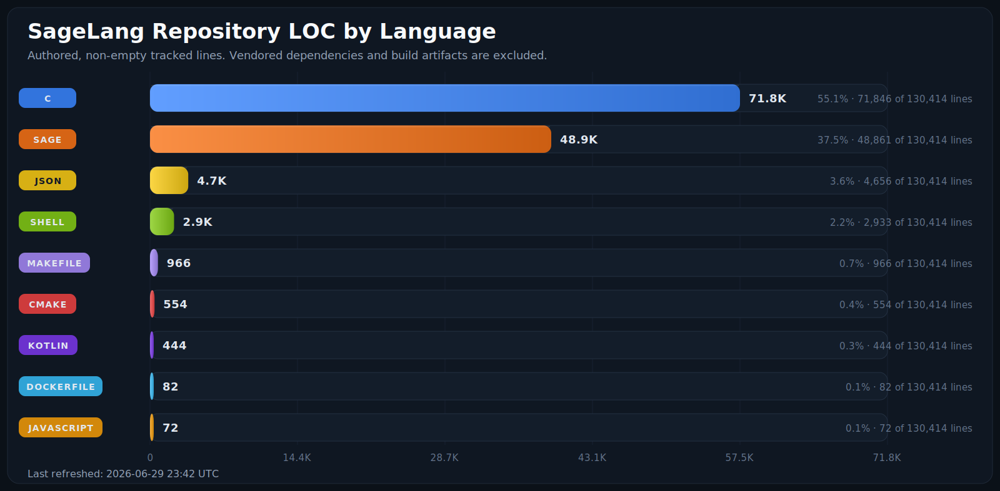
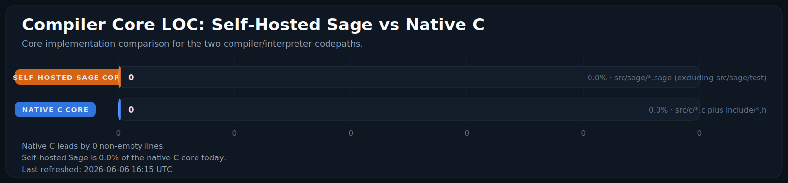
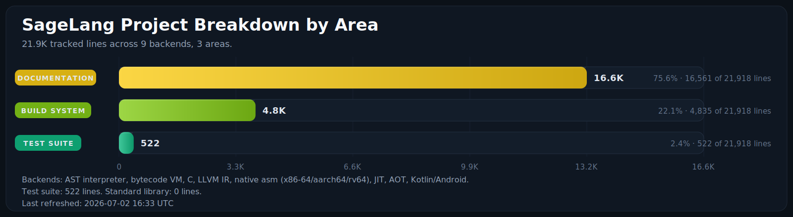
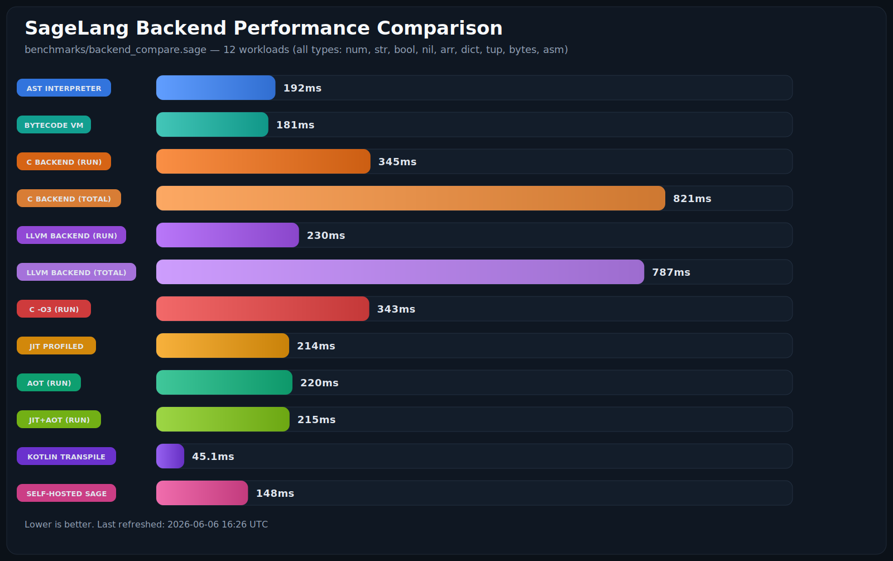
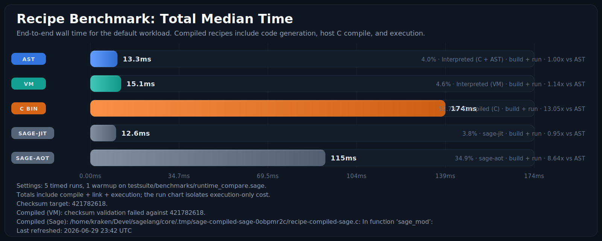
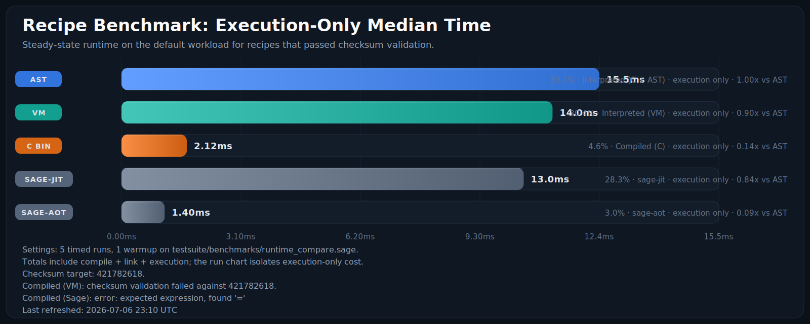

# Sage

**A clean, indentation-based systems programming language built in C.**


Sage is a systems programming language that combines the readability of Python
(indentation blocks, clean syntax) with the performance of C. It features ten
execution backends (C, LLVM IR, native x86-64/aarch64/rv64/mips, bytecode VM,
SageMetal VM, JIT, AOT, Kotlin/Android), a self-hosted interpreter with hybrid
JIT/AOT profile-guided type specialization, Vulkan + OpenGL graphics, true
atomic operations and POSIX semaphores for multicore concurrency, and three GC
modes (tracing, ARC, ORC).

**Current version:** v4.0.0 · **Spec version:** 2.0 · **License:** MIT

## Install (One-line Install System — OIS)

```bash
git clone https://github.com/Night-Traders-Dev/SageLang.git && cd SageLang && chmod +x install.sh && ./install.sh
```

The OIS installer handles environment detection, dependency installation (CURL,
OpenSSL, Vulkan), and automatic `PATH` configuration for Bash, Zsh, and Fish
across Linux, macOS, FreeBSD, and WSL2.

| Platform | Package Manager | Notes |
|----------|----------------|-------|
| **Linux** | apt, pacman, dnf, yum, zypper, apk, emerge, xbps | Full support |
| **macOS** | Homebrew or MacPorts | Auto-installs either if needed (pending) |
| **FreeBSD** | pkg | Native BSD-Make support |
| **WSL2** | (same as Linux) | No differences from Linux |

## Quick Example

```sage
import math
print math.sqrt(16)    # 4

import http
let resp = http.get("https://example.com")
if resp != nil:
    print resp["status"]   # 200

async proc compute(x):
    return x * x

let future = compute(42)
print await future     # 1764
```

## Building

```bash
make clean && make -j$(nproc)   # produces ./sage and ./sage-lsp
```

Desktop build links against `libm`, `pthread`, `dl`, `libcurl`, and OpenSSL.
Four build paths are supported: desktop C, self-hosted bootstrap, Pico/RP2040,
and SageMake. See the **[Build Guide](core/docs/Build_Guide.md)** for CMake,
SageMake, build parameters, and training targets.

## Codebase & Benchmark Metrics

Refreshed by `make charts` and as part of the default `make` build (count
authored, non-empty tracked lines; exclude vendored deps and build artifacts).





### Cross-Backend Comparison



Run `python3 scripts/generate_backend_chart.py` or
`bash benchmarks/run_backend_compare.sh` to regenerate (8 workloads across all
native backends).

### Recipe Benchmarks




Generated from `python3 scripts/benchmark_recipes.py --runs 5 --warmups 1`
against `benchmarks/runtime_compare.sage`. Run `make benchmark-python` to
compare all Sage backends against CPython 3.x on 10 workloads.

## Features (Implemented)

Detailed feature documentation lives under **[core/docs/](core/docs/)**. This
section is a summary with links to the relevant guide.

### Language & Core

- **Indentation-based syntax** — no braces; clean, consistent indentation
- **Variables** — `let` and `var` for bindings (both allow reassignment in current spec)
- **Types** — Integers, Strings, Booleans, Nil, Arrays, Dictionaries, Tuples,
  Classes, Instances, Exceptions, Generators, Bytes
- **Functions** — `proc name(args):` with recursion, closures, first-class functions, inline anonymous proc expressions (`proc(x): body end`)
- **Control flow** — `if`/`else`, `while`, `for`, `break`, `continue`,
  `try`/`catch`/`finally`, `match`/`case`/`default`, `defer`
- **Operators** — arithmetic, comparison, logical (`and`/`or`), bitwise
  (`&`/`|`/`^`/`~`/`<<`/`>>`), unary
- **v2.0 enhancements** — type annotations, `sage check`, structs, enums,
  traits, match guards, default params, multiline literals, escape sequences,
  hex/octal/binary literals, `super` auto-self, dunder hooks (`__str__`/`__eq__`),
  bytes type, `unsafe` blocks, doc comments (`##`), path/hash builtins, `elif`,
  `var` keyword
- **Metaprogramming** — `comptime:` blocks, `comptime()` expressions, pragmas
  (`@inline`/`@packed`/`@section`/`@align`/`@deprecated`/`@noreturn`), AST macros,
  generics (`proc identity[T](x: T) -> T:`)

📖 **[SageLang Guide](core/docs/SageLang_Guide.md)** ·
[Import Semantics](core/docs/Import_Semantics.md) ·
[Stability Policy](core/docs/meta/STABILITY.md)

### Execution Backends & Compilers

C codegen, LLVM IR (`--compile-llvm`), native assembly (x86-64/aarch64/rv64/mips),
bytecode VM, SageMetal VM, JIT, AOT, and Kotlin/Android — 10 backends total.

📖 **[JIT & AOT Guide](core/docs/JIT_AOT_Guide.md)** ·
[CLI Reference](core/docs/CLI_Reference.md) ·
[SGVM Guide](core/docs/SGVM_Guide.md) ·
[Android Guide](core/docs/Android_Guide.md)

### Memory Management

Three GC modes: concurrent tri-color mark-sweep (default, SATB write barriers,
sub-ms STW), ARC (deterministic reference counting), and ORC (optimized RC with
Lins' trial deletion cycle collector).

📖 **[GC Guide](core/docs/GC_Guide.md)**

### Concurrency

Threads, `async`/`await`, true `__atomic` operations, POSIX semaphores,
condition variables, read-write locks, and SMP/hyperthreading detection with
core affinity.

📖 **[Concurrency Guide](core/docs/Concurrency_Guide.md)**

### Security

Type-safe value access, recursion/loop/string-length limits, abort-on-OOM
allocations, shell-injection prevention, FFI bounds, memory safety, and
bitwise shift validation.

📖 **[Safety Guide](core/docs/Safety_Guide.md)** ·
[Security Policy](core/docs/meta/SECURITY.md)

### Standard Library

100+ native functions plus a modern Sage standard library (`lib/std/`): regex,
datetime, log, argparse, compress, unicode, fmt, testing, enum, trait, signal,
db, channel, threadpool, atomic, rwlock, condvar, debug, profiler, docgen,
build, interop. Native modules: `math`, `io`, `string`, `sys`, `thread`, `fat`,
`socket`, `tcp`, `http`, `ssl`. JSON via a complete 1:1 cJSON port.

📖 **[StdLib Guide](core/docs/StdLib_Guide.md)** ·
[Networking Guide](core/docs/Networking_Guide.md)

### OS Development

44 binary-format parsers, hardware abstraction, boot, kernel, filesystem, image,
Linux kernel support, and QEMU virtualization modules for bare-metal, UEFI, and
OS kernel development under `lib/os/`. Bare-metal C runtime for `--compile-bare`
and `--compile-uefi`.

📖 **[Bare-Metal / OSdev / UEFI Guide](core/docs/Baremetal_OSDev_UEFI_Guide.md)** ·
[FAT Filesystem Guide](core/docs/FAT_Filesystem_Guide.md)

### GPU Graphics Engine (Vulkan + OpenGL)

Full Vulkan backend with handle-based resource management, OpenGL 4.5+ backend,
LLVM-compiled GPU support, bytecode VM GPU opcodes, and professional rendering
libraries (PBR, shadows, deferred, SSAO, SSR, TAA, glTF, frame graph).

📖 **[Vulkan GPU Guide](core/docs/Vulkan_GPU_Guide.md)**

### Machine Learning & LLMs

Tensors, neural networks, optimizers, GPU acceleration (cuBLAS), NPU backends
(Hexagon/Exynos/NNAPI/NEON), CUDA library, and a full LLM toolkit (transformers,
quantization, TurboQuant, GGUF, training pipeline, evolve).

📖 **[ML & CUDA Guide](core/docs/ML_CUDA_Guide.md)** ·
[LLM Guide](core/docs/LLM_Guide.md)

### Agent AI & Chatbots

ReAct agent loop, planner, sandbox, Tree of Thoughts, critic, router,
supervisor, grammar-constrained decoding, and a chatbot framework with personas.

📖 **[Agent & Chat Guide](core/docs/Agent_Chat_Guide.md)**

### Blockchain & Cryptography

Pure-Sage enterprise L1 blockchain (SageChain) with smart contracts, NFTs, PoW/PoA
consensus, wallet, RPC, and P2P. Cryptographic suite: SHA-256, HMAC, Base64,
RC4, PBKDF2, xoshiro256** PRNG, UUID.

📖 **[Blockchain](core/docs/Blockchain.md)** ·
[Cryptography Guide](core/docs/Cryptography_Guide.md)

### Discord Bots

Gateway and REST API support for building Discord bots, mirroring Python's
`discord` and `discord.ext` libraries.

📖 **[Discord Bot Guide](core/docs/Discord_Bot_Guide.md)**

### Developer Tooling

REPL, code formatter, linter, syntax highlighting (TextMate + VSCode), and an
LSP server with diagnostics, completion, hover, and formatting.

📖 **[Tooling Guide](core/docs/Tooling_Guide.md)** ·
[CLI Reference](core/docs/CLI_Reference.md)

### Self-Hosting

Sage can run Sage through a self-hosted interpreter written entirely in
SageLang (lexer, parser, interpreter, compiler toolchain ported from C to Sage).

📖 **[Self-Hosting Guide](core/docs/Self_Hosting_Guide.md)**

## Roadmap

All 18 development phases are complete (core logic, functions, types, GC, data
structures, OOP, control flow, modules, security/perf hardening, low-level
programming, compiler, concurrency, tooling, self-hosting, security audit,
Vulkan graphics, Linux kernel support, and ML/training).

📝 **[Detailed Roadmap](core/docs/meta/ROADMAP.md)** ·
[Changelog](core/docs/meta/CHANGELOG.md) ·
[Benchmarks](core/docs/meta/BENCHMARKS.md)

## Project Stats

- **Phases Completed**: 18/18 (100%)
- **Test Suite**: 2070+ total (331 interpreter + 28 compiler + 88 JSON + 1623 self-hosted)
- **Backends**: 10 (C, LLVM, native x86-64/aarch64/rv64/mips, bytecode VM, SageMetal VM, JIT, AOT, Kotlin/Android)
- **Self-Hosting**: Lexer, parser, interpreter, formatter, linter, LSP, codegen, compiler ported to Sage
- **Status**: Specification locked (v2.0)
- **License**: MIT

## Contributing

Sage is an educational project aimed at understanding compiler construction and
language design. Contributions are welcome!

1. Fork the project
2. Create your feature branch (`git checkout -b feature/AmazingFeature`)
3. Commit your changes (`git commit -m 'Add some AmazingFeature'`)
4. Push to the branch (`git push origin feature/AmazingFeature`)
5. Open a Pull Request

Follow the existing code style, add comments for complex logic, update
documentation for new features, and write example code demonstrating new
features. See the [templates/](templates/) directory for library scaffolding.

## Resources

- **Repository**: [github.com/Night-Traders-Dev/SageLang](https://github.com/Night-Traders-Dev/SageLang)
- **Documentation**: [core/docs/](core/docs/) · [Language Book](core/docs/sagelang-book.md) · [Language Reference](core/docs/SageLang_Reference.md)
- **Issues**: [GitHub Issues](https://github.com/Night-Traders-Dev/SageLang/issues)
- **Discussions**: [GitHub Discussions](https://github.com/Night-Traders-Dev/SageLang/discussions)

## License

Distributed under the MIT License. See [LICENSE](LICENSE) for more information.
