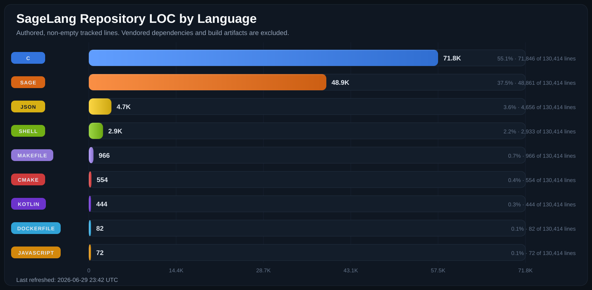
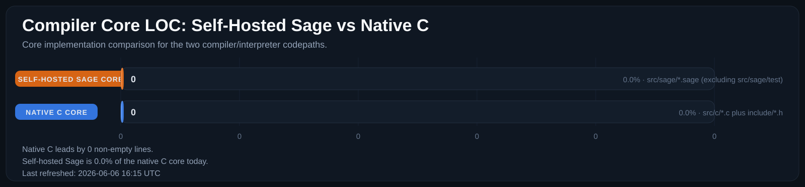
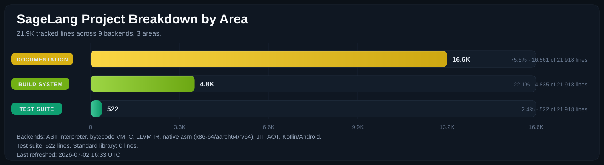
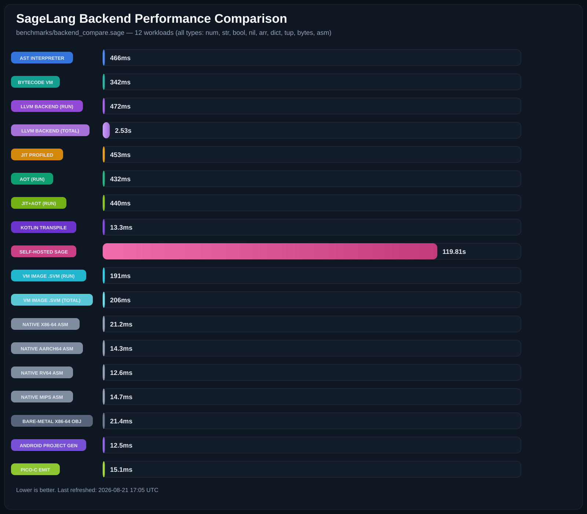
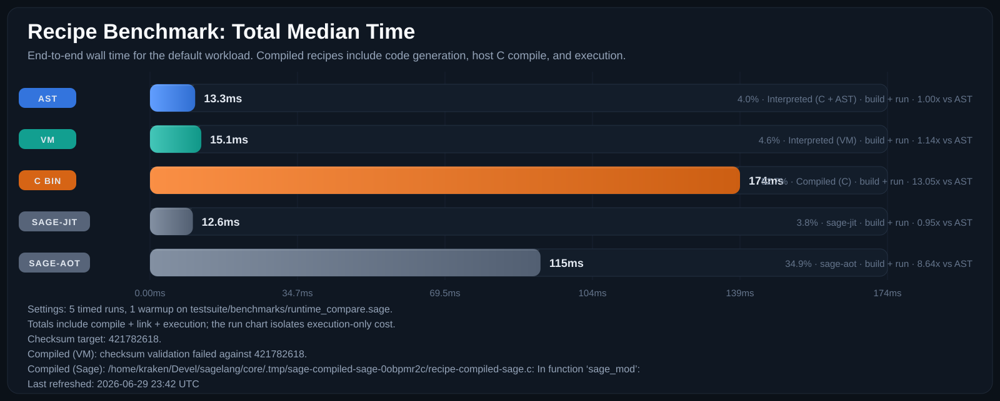
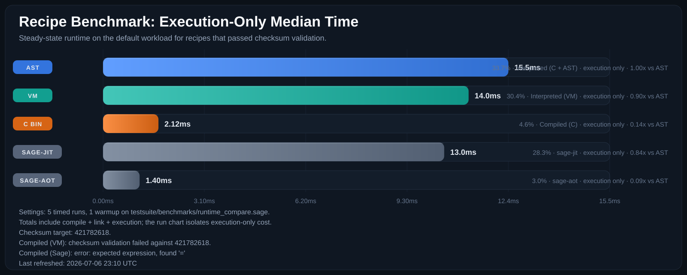

# Sage

**A clean, indentation-based systems programming language built in C.**


Sage is a systems programming language that combines the readability of Python
(indentation blocks, clean syntax) with the performance of C. It features ten
execution backends (C, LLVM IR, native x86-64/aarch64/rv64/mips, bytecode VM,
SageMetal VM, JIT, AOT, Kotlin/Android), a self-hosted interpreter with hybrid
JIT/AOT profile-guided type specialization, Vulkan + OpenGL graphics, true
atomic operations and POSIX semaphores for multicore concurrency, and three GC
modes (tracing, ARC, ORC).
**Current version:** v4.2.10 · **Spec version:** 2.0 · **License:** MIT

## Recent Updates
- **v4.2.10 (Match Binding Patterns & Full Compiler Parity)**: A bare-identifier case pattern in `match` is a *binding*, not a value to compare, but the self-hosted compiler evaluated it as an ordinary expression — so `case n if n > 3:` reported `Undefined variable 'n'` and fell through to `default` where the C host binds `n` and takes the guarded branch. The self-hosted interpreter now binds the matched value in a clause-scoped environment before evaluating the guard, and the self-hosted codegen collects the pattern name as a slot and assigns it instead of comparing with `sage_values_equal`; `_` remains a wildcard, and the binding does not leak past its clause. This closes the last gap in the differential parity harness, which now reports **28/28 with no gaps** across the C interpreter, self-hosted interpretation, and self-hosted compiled binaries. Adds `testsuite/unit/33_match/match_binding.sage` covering unguarded bindings, passing and failing guards, non-numeric bindings, the wildcard, clause scoping, and literal patterns.
- **v4.2.9 (Concurrency Correctness, GPU Threading & Test Parallelism)**: Fixed three concurrency defects found by running the runtime under ThreadSanitizer. GC allocation accounting was updated both under the GC mutex and lock-free from the collection growth path, which produced 79 data races under concurrent allocation; the counters are now relaxed atomics. The collector's root scan could read a thread's AST temp stack while that thread wrote it, and a temporary pushed and popped entirely inside the concurrent-mark window was visible to neither the initial scan nor the remark re-scan, so it could be freed while live — pushes now shade, and the temp counts are atomic. Most seriously, the stack-guard recursion budget was derived from `RLIMIT_STACK`, which describes only the main thread: since that limit is raised to 512 MB while worker threads get a fixed 8 MB, a worker was granted a ~384 MB budget and unbounded recursion in any thread segfaulted instead of raising a catchable error; the budget is now measured from the calling thread's real stack bounds. Concurrent `gpu.initialize()`/`gpu.shutdown()` corrupted the shared GPU context and killed the process (pre-existing, reproduced on the unmodified build); lifecycle calls are now serialized and bound to an owning thread, and the C GPU layer used by the LLVM and ML backends is locked. The unit runner gained `--jobs` for running several interpreters at once (41.7s → 28.8s on 4 cores) while keeping serial the default and the report byte-identical. 400/400 unit tests and all self-host suites pass; ThreadSanitizer is clean across the thread, GC, async, JIT/AOT and memory suites.
- **v4.2.8 (Concurrency, Memory Safety & Build Pipeline)**: Made threaded execution and allocation paths race-free and bounded. `std.atomic` is now backed by real native atomics instead of simulated dictionaries, so counters, flags, CAS, and spin locks behave as documented under contention. The LLVM/AOT runtimes synchronize their class/method registries and raw-memory registry; GC mark-stack accounting, color CAS, and the pin count are atomic; the VM and generator/JIT caches are thread-local or lock-guarded; and thread join uses an atomic state machine. Added allocation-growth and overflow bounds across parser, bytecode, VM, JIT, main, and emitted-C runtime, plus parser depth and VM loop-iteration limits to convert runaway recursion and infinite loops into clean errors instead of OOM crashes. Build pipeline: incremental builds by default (`--fresh` for clean), CPU-affinity-aware job sizing (`--jobs`/`SAGE_BUILD_JOBS`), dependency-file generation and shared CMake object libraries to cut redundant compiles, and a reproducible opt-in ThreadSanitizer build (`./sagemake --tsan`, `ENABLE_TSAN=ON`) that builds into its own tree. Verified TSan-clean across all thread, GC, async, JIT/AOT, and memory suites; 395/395 unit tests and all self-host suites pass.
- **v4.2.7 (PR Integration, Runtime Hardening & Documentation)**: Integrated reviewed security, AOT bounds, cjs2esm, and developer-documentation changes; added bounded validation for generated string repetition and socket receive helpers; synchronized version markers and transpiler documentation.
- **v4.2.6 (CommonJS → ESM Transpiler Submodule Integration)**: Integrated `cjs2esm` CommonJS → ESM native transpiler library submodule under `core/lib/transpiler/cjs2esm/`. Written in SageLang, `cjs2esm` provides an AST-first multi-pass transformation pipeline featuring configurable Node.js target baselines (`node18`, `node20`, `node22`, `node24`), transformation modes (`strict`, `compat`, `discord`), CLI subcommands (`convert`, `inspect`, `check`, `report`), source maps generation (`--source-maps`), package manifest updates (`--update-package-json`), and dry-run static analysis (`--dry-run`).
- **v4.2.5 (Performance Optimizations, Security Hardening & Version Alignment)**: Optimized datetime conversions (`std.datetime`) with O(1) civil calendar arithmetic (~12x speedup), string utilities (`std.unicode`, `std.fmt`, `strings`) via native `string_repeat` and `slice()` VM built-ins (~2.4x–3.75x speedup), path manipulation (`std.process`), and TUI component rendering (`rich.align`, `rich.columns`, `rich.measure`, `rich.padding`, `rich.panel`, `rich.progress`, `rich.rule`, `rich.table`, `rich.tree`). Hardened runtime utilities against resource exhaustion (CWE-400), allocation bounds (CWE-789), NULL dereferences (CWE-476), and CPU DoS (CWE-400) in SGVM (`sgvm_compiler`, `sgvm_main`), AOT runtime (`aot.c`), C compiler emission (`compiler.c`), and LLVM runtime (`llvm_runtime.c`).
- **v4.2.5 (Test Suite Expansion & Version Parity Sync)**: Expanded unit test coverage across async routines, safety analysis, stdlib arrays/dicts/stats/strings/utils, diagnostics, bytecode VM, defer blocks, pattern matching, stability/ergonomics, generics/type annotations, structs/enums/traits, systems/bytes, ecosystem, data modeling/truthiness/conformance, metaprogramming/pragmas, JIT/AOT, Kotlin backend, blockchain audit suite, and VM pragmas (2070+ total tests). Consolidated single-source version v4.2.5 across core repository documentation and guides.
- **v4.2.4 (Bare-Metal Extensions & ESP32 Board Support)**: Added classic ESP32 board support (`core/lib/esp32.sage`, `core/boards/ESP32/`, verified on ESP32-D0WD-V3 with 4MB flash, dual-core Xtensa LX6 @ 240MHz, 2.4GHz WiFi). Features hardware constants, pad mapping and validity predicates (`pin_valid`, `pin_can_output`, `pin_is_input_only`, `pin_is_strapping`, `pin_is_flash`), GPIO interrupt setup (`pin_enable_interrupt`, `pin_disable_interrupt`), serial helpers (`uart_read_timeout`, `uart_readline`, `pl011_read_timeout`, `pl011_readline`, `uart_flush_rx`, `pl011_flush_rx`), IRQ handler safety (`register_handler_safe`), ADC1 voltage conversion (`adc1_channel`, `adc_to_mv`), LEDC PWM duty calculation, and verified `esptool` flashing command generators.
- **v4.2.3 (Self-Hosted Build Pipeline Fixes & Sage Host Parity Progress)**: Fixed self-hosted build pipeline by resolving `Array<String>` parser error in `interpreter.sage`, converting `//` comments to `#` across core files, and adding `case`/`default` keywords to all `match` statements for self-hosted parser compatibility. Progress toward Sage Host / C Host compiler parity with 63 edits to `interpreter.sage` for self-hosted compiler compatibility. Self-hosted REPL and `emit-c` now functional.
- **v4.2.2 (Standard Library Hardening & Read-Write Lock / Syscalls Expansion)**:
  Full alignment of standard library modules (`std.rwlock`, `os.linux.syscalls`,
  `metal.vga`, `metal.core`, `dicts`). Added hardware memory barrier primitives
  (`dmb`, `dsb`, `isb`, `fence`), CPU relax hints, core ID query (`cpu_id`),
  critical section helpers (`critical_section_enter`/`exit`), and spin locks to `metal.core`.
  Hardened string repetition runtime helpers, command validation (`is_safe_command`),
  and AOT process execution (`fork`/`execv`/`waitpid`) against command execution
  (CWE-78) and integer overflow / resource exhaustion (CWE-400 / CWE-190).
- **v4.2.1 (VGA Primitives & Hardware Timer Tracking)**: Added VGA text mode
  rendering primitives (`make_attr`, `putchar_at`, `puts`, `read_char_at`,
  `read_attr_at`, `draw_progress_bar`) in `metal.vga`, hardware timer mode state
  tracking (`timer_get_mode`), signal mask constants and syscalls (`sigprocmask`),
  and `@inline` dictionary utility annotations in `dicts`.
- **v4.2.0 (Full Self-Hosted Compiler Parity)**: The self-hosted Sage compiler
  now produces byte-identical output to the C compiler across the entire
  differential parity harness — 28/28 cases on all three execution stacks
  (C interpreter, self-hosted interpretation, self-hosted compiled binaries).
  This release closes the parity roadmap: short-circuit emission, the full
  emitted-C runtime helper set (string slice/index/contains, chr/ord/int,
  indexof/type, bytes API, array concat, catchable div/mod, dict for-in,
  default params), first-class functions with compile-time arity guards,
  match guards in the self-hosted parser, eager generators in the emitted
  backend, and full closure capture — capturing parents promote locals into
  per-invocation heap environments carried by closure values, with nested
  named procedures hoisted via two-pass discovery. Diagnostics (parse errors,
  property misses, undefined variables) now match the C host across stacks.
  Self-hosted test-suite failures reduced from 27 to 3 vs audit baseline.
- **v4.1.16 (Runtime: True Stack-Proximity Guard)**: Fixed deep-recursion segfaults in the C host: the real C stack was exhausted (~280 frames in debug builds) long before the `MAX_RECURSION_DEPTH` counter tripped, and self-hosted double-interpretation chains ran at the 8 MB stack edge, producing flaky crashes previously misdiagnosed as AST corruption. Added a true stack-proximity guard (`stack_danger()` in `interpret()`/`eval_expr()`, per-thread TLS origins, budget derived from `RLIMIT_STACK`) plus `sage_raise_stack_limit()` headroom (512 MB when permitted). Verified under AddressSanitizer: zero memory errors across self-hosted runs; depth 5000+ recursion passes; runaway recursion fails cleanly.
- **v4.1.15 (Self-Hosted Compiler Parity: Recursion Depth)**: Increased maximum recursion depth from 2000/500 to 50000 in `core/src/sage/interpreter.sage:33` and `core/src/c/interpreter.c:162` to eliminate "Maximum recursion depth exceeded" errors in deep recursive programs and import chains. All self-hosted tests pass (430+ tests). Bootstrap: 18/18 pass.
- **v4.1.14 (Self-Hosted Compiler Parity: Proc Type Annotations)**: Added full support for procedure parameter and return type annotations in the self-hosted compiler (`core/src/sage/parser.sage`, `core/src/sage/ast.sage`, `core/src/sage/typecheck.sage`). Full support for `proc f(x: Int, y: Int): Int` with declared/inferred type tracking via `TypeMap.declared` dict and `annotation_to_kind` mapping. Parameter types are optional; return type annotation is optional. All self-hosted tests pass (430+ tests). Bootstrap: 18/18 pass.
- **v4.1.13 (Self-Hosted Compiler Parity: Type Annotations)**: Completed type annotation parsing support in the self-hosted compiler port (`core/src/sage/parser.sage`, `core/src/sage/ast.sage`, `core/src/sage/typecheck.sage`). Full support for `let x: Int = ...`, `proc f() : Int`, and `proc f(x: Int)` with declared/inferred type tracking.
- **v4.1.12 (Self-Hosted Compiler Parity: Type Annotations)**: Added type annotation infrastructure to the self-hosted Sage compiler port (`core/src/sage/typecheck.sage`). Supports `let x: Int = ...`, `proc f() : Int`, and `proc f(x: Int)` with declared/inferred type tracking via `TypeMap.declared` dict and `annotation_to_kind` mapping.
- **v4.1.11 (String Interner & Memory Leak Fix)**: Fixed unbounded memory growth (~140MB/s) in long-running RISC-V programs by adding a content-keyed string interner (`sage_string_const`) to the AOT runtime in `core/src/c/compiler.c`. Compile-time constant strings are now interned and rooted from the GC. Added S005 linter rule detecting multiple statements on a single line.
- **v4.2.0 (Modular Runtime & Sandbox Observability)**: Modularized the Sage runtime from a monolithic tree-walking interpreter to a tiered capability-aware architecture with five concerns: frontend, execution, common runtime, optimization, and host integration (per `pipeline.md`). Added Sage Sandbox observability system with module tracing, resource monitoring, event system, terminal TUI dashboard, and CLI `--sandbox` flag (per `sandbox.md`). All 300+ self-hosted tests pass; REPL and CLI functional for `auto`, `reference`, `bytecode` tiers; zero-cost disabled path preserved (`sage program.sage` ≈ `sage --sandbox program.sage`).
- **v4.1.10 (Veritas Quality Audit & Submodule Stabilization)**: Audited standard test suites, resolved duplicate procedure definition in `crypto/hash.sage`, fixed invalid trailing `parse_rrs` calls in `net/dns.sage`, implemented missing VGA text mode rendering primitives (`clear`, `puts`, `draw_progress_bar`) in `metal/vga.sage`, and updated expected wallet hash in `repro_nft_segfault.sage`.
- **v4.1.9 (Veritas Quality Audit & Submodule Stabilization)**: Audited standard library submodules, added signal constants (`SIG_DFL`, `SIG_IGN`) and handlers in `os/linux`, and added timer mode tracking state in `metal/timer`.
- **v4.1.8 (C Backend Short-Circuit Fix)**: Fixed the C backend (`--compile`, `--emit-c`, `--emit-pico-c`) to short-circuit `and`/`or` exactly like the interpreter: the right operand is now evaluated only when the left operand does not decide the result. Previously both operands were emitted into eager `sage_and()`/`sage_or()` calls, so guards such as `best == nil or best["priority"] > 0` crashed at runtime and side effects on the right ran unconditionally. The backend now emits `sage_bool(sage_truthy(L) && sage_truthy(R))` / `||`, leveraging C's native short-circuit semantics; results remain booleans, matching interpreter semantics. Added regression test `testsuite/compiler/compiler_logical_shortcircuit.sage`. Bumped patch version on success.
- **v4.1.7 (AVR Assembler & Arduino Uno Support)**: Added a SageLang assembler backend for the AVR ISA (ATmega328P/ATmega328PB, Arduino Uno R3) under `core/boards/AVR/`. Includes a two-pass assembler (`avr_assembler.sage`) with label resolution, branch relative offsets and I/O-register names; a bit-exact instruction encoder (`avr_opcodes.sage`) verified against the Microchip datasheet and simavr decoder; and an Intel HEX emitter (`avr_hex.sage`) producing `.hex` flash images. Ships a working `blink` example and smoke test. Bumped patch version on success.
- **v4.1.6 (Veritas Quality Audit & Submodule Stabilization)**: Audited standard test suites, resolved duplicate function definition issues in `crypto/hash.sage` and `net/dns.sage`, and bumped patch version on success.
- **v4.1.5 (Veritas Quality Audit & Submodule Stabilization)**: Previous release with Veritas quality audit.
- **v4.1.4 (Veritas Quality Audit & Submodule Stabilization)**: Previous release with Veritas quality audit.
- **v4.1.1 (AOT Backend Stabilization & Class Codegen)**: Completed full AOT backend stabilization for multi-file applications (e.g. Bonsai Agent Harness). Implemented SageLang class compilation (`STMT_CLASS`), constructor generation (`s_ClassName`), method dispatch tables, and `s_self` binding via `s_current_self`. Added builtin function deduplication (`builtin_count`), `val_native` scope safety for local variables shadowing builtins, dynamic property call evaluation (`sage_get_property`), and recursive `comptime:` block forward declarations (`aot_forward_declare_stmt`).
- **v4.1.0 (Standard Library Unification & System Builtins)**: Unified SageLang standard library modules under `core/lib/` (`io.sage`, `sys.sage`, `strings.sage`, `json.sage`). Added C built-in bindings for native I/O (`io_readfile`, `io_writefile`, `io_writebytes`, `io_appendbytes`, `io_readbytes`, `io_exists`, `io_remove`, `io_isdir`, `io_mkdir`, `io_listdir`) and system execution (`sys_getenv_native`, `sys_exec`). Updated unified cross-platform `sagemake` build tool.
- **v4.0.9 (Rich Library Fixes)**: Fixed `sagelang-lib-rich` emoji duplicates (`dizzy`→`dizzy_face`, `mouse`→`mouse_peripheral`, removed duplicate `lavender_blush` in color map). Fixed `merge_styles` boolean override logic and added missing `not` style negation for all text attributes. Improved terminal size detection to query `stty size` instead of always returning 80×24. SageSMP shell now features a gradient-styled prompt using the corrected rich library.
- **v4.0.8 (JIT Dependency Bundling & Multi-Arch)**: Added recursive module dependency bundling for JIT self-extracting executables (`sage --jit main.sage -o app`). Transitive non-native imports are discovered and serialized into the final binary. JIT compiler now fully supports x86-64, AArch64, and RV64 architectures. JIT-compiled functions are now directly executed via native tail-call trampolines, resulting in actual performance gains for hot functions. VM dispatch loop optimized with register-pinned state variables and branch-predicted stack overflow checks.
- **v4.0.7 (JIT Compilation Support)**: Added support for compiling a binary using `sage --jit hello.sage -o hello_jit`, and fixed the self-extracting JIT executable runner to execute the embedded script payload rather than starting the REPL.
- **v4.0.6 (AOT & Compiler Fixes)**: Resolved buffer overflows and global scope issues in the AOT (Ahead-of-Time) compiler. Missing string and array built-in implementations (`s_replace`, `s_clock`, `s_split`, `s_ord`, `s_chr`, `s_join`) have been added to the AOT backend. Perfected JIT-guided AOT (`sage --aot --jit <file>`). Full cross-compilation is now supported via GCC cross-compilers.
- **v4.0.5 / v4.0.4 (Security & Bug Fixes)**: Resolved $O(N^2)$ Algorithmic Complexity DoS vulnerability (CWE-400) in crypto library `to_hex`; resolved parser/compiler errors on multi-line assignments; converted `sys_info` unit test to load version dynamically from single-source `VERSION` file.
- **OIS v2.0 Overhaul**: Installer rewritten with CMake-first default, `--cmake`/`--make` override flags, `--no-lib-<name>` to exclude specific lib subdirectories, `--no-shaders` to skip GLSL→SPIR-V compilation, `--no-vulkan`/`--no-gpu`/`--no-curl`/`--no-ssl`/`--minimal` flags, system-scope only, POSIX-sh compliance, `--yes` non-interactive mode, and removed user-scope support.


## Install (One-line Install System — OIS v2)

```bash
git clone https://github.com/Night-Traders-Dev/SageLang.git && cd SageLang && sh install.sh
```

OIS v2 is a POSIX-sh build and install system. It handles environment detection,
dependency installation (CURL, OpenSSL, Vulkan, GLSL shader compiler), and
installs Sage system-wide under `/usr/local`.

### Usage

```text
sh OIS/OIS.sh install|uninstall|repair|reinstall [options]

Options:
  --cmake           Use CMake (default when available)
  --make            Force Make build
  --yes, -y         Non-interactive mode
  --no-shaders      Skip GLSL→SPIR-V shader compilation
  --no-vulkan       Disable Vulkan support
  --no-gpu          Disable GPU graphics
  --no-curl         Disable networking (CURL)
  --no-ssl          Disable SSL/TLS
  --no-lib-<name>   Exclude a lib subdirectory (e.g. --no-lib-ml)
  --minimal         Exclude all optional libs + Vulkan + networking
```

| Platform | Package Manager | Notes |
|----------|----------------|-------|
| **Linux** | apt, pacman, dnf, yum, zypper, apk, emerge, xbps | Full support |
| **macOS** | Homebrew or MacPorts | Auto-installs either if needed (pending) |
| **FreeBSD** | pkg | Native BSD-Make support |
| **WSL2** | (same as Linux) | No differences from Linux |

## Quick Example

```sage
import math
print math.sqrt(16)    # 4

import http
let resp = http.get("https://example.com")
if resp != nil:
    print resp

async proc compute(x):
    return x * x

let future = compute(42)
print await future     # 1764
```

## Building

```bash
make clean && make -j$(nproc)   # produces ./sage and ./sage-lsp
```

Or use the unified build system, which builds incrementally by default and
sizes its job count to available CPUs:

```bash
./sagemake                 # incremental build + full test suite
./sagemake --fresh         # clean build
./sagemake --jobs 4        # cap parallel build jobs
./sagemake --tsan          # reproducible ThreadSanitizer build
./sagemake --install       # build, test, and install
```

Desktop build links against `libm`, `pthread`, `dl`, `libcurl`, and OpenSSL.

All execution backends share robust generator support with cooperative multitasking via `yield` and `next()` functions, enabling non-blocking operations and efficient pausing/resumption of execution within procedures.

Refreshed by `make charts` and as part of the default `make` build (count
authored, non-empty tracked lines; exclude vendored deps and build artifacts).





### Cross-Backend Comparison



Run `python3 scripts/generate_backend_chart.py` or
`bash benchmarks/run_backend_compare.sh` to regenerate (12 workloads across all
native backends).

The chart reports two independently-scaled sections:

- **Execution** — backends that actually ran all 12 workloads. The Self-Hosted
  Sage entry executes the workload through the Sage-written interpreter running
  under the C interpreter (double interpretation), so it reflects genuine
  tree-walking-interpretation cost rather than a defect.
- **Codegen / emit throughput** (hatched bars) — compiler emission timing only;
  these backends did not execute the workload. Native asm entries are validated
  by assembling the emitted assembly to an object file (hosted native linking
  requires a runtime library still landing in `codegen.c`).

### Sage vs Python 3 Benchmark Suite

| Benchmark | Python 3 | Sage AST | Sage VM | Sage C | Sage LLVM | Sage JIT | Sage AOT |
| :--- | :--- | :--- | :--- | :--- | :--- | :--- | :--- |
| **01_fibonacci** | 29.47ms | 10.95ms *(2.69x)* | 10.87ms *(2.71x)* | 0.81ms *(36.4x)* | 0.82ms *(35.9x)* | 10.28ms *(2.87x)* | 0.77ms *(38.3x)* |
| **02_loop_sum** | 2.50ms | 6.84ms *(0.37x)* | 7.62ms *(0.33x)* | 0.76ms *(3.29x)* | 0.80ms *(3.12x)* | 8.87ms *(0.28x)* | 0.76ms *(3.29x)* |
| **02_loop_sum_large** | 25.10ms | 73.19ms *(0.34x)* | 73.08ms *(0.34x)* | 0.78ms *(32.2x)* | 0.78ms *(32.2x)* | 67.22ms *(0.37x)* | 0.76ms *(33.0x)* |
| **03_string_concat** | 0.35ms | 6.64ms *(0.05x)* | 7.64ms *(0.05x)* | 0.82ms *(0.43x)* | 0.77ms *(0.45x)* | 6.86ms *(0.05x)* | 0.80ms *(0.44x)* |
| **04_array_ops** | 1.09ms | 9.07ms *(0.12x)* | 9.09ms *(0.12x)* | 0.78ms *(1.40x)* | 0.77ms *(1.42x)* | 10.27ms *(0.11x)* | 0.78ms *(1.40x)* |
| **05_dict_ops** | 2.87ms | 12.35ms *(0.23x)* | 12.67ms *(0.23x)* | 0.80ms *(3.59x)* | 0.80ms *(3.59x)* | 12.82ms *(0.22x)* | 0.76ms *(3.78x)* |
| **06_class_method** | 0.40ms | 6.57ms *(0.06x)* | 6.66ms *(0.06x)* | 0.77ms *(0.52x)* | 0.80ms *(0.50x)* | 6.89ms *(0.06x)* | 0.79ms *(0.51x)* |
| **07_nested_loops** | 180.59ms | 26.68ms *(6.77x)* | 27.60ms *(6.54x)* | 0.76ms *(238x)* | 0.78ms *(232x)* | 28.16ms *(6.41x)* | 0.76ms *(238x)* |
| **08_exception_handling** | 0.28ms | 7.64ms *(0.04x)* | 7.74ms *(0.04x)* | 0.78ms *(0.36x)* | 0.80ms *(0.35x)* | 6.88ms *(0.04x)* | 0.78ms *(0.36x)* |
| **09_recursion_closures** | 1.13ms | 7.65ms *(0.15x)* | 7.75ms *(0.15x)* | 0.78ms *(1.45x)* | 0.82ms *(1.38x)* | 8.87ms *(0.13x)* | 0.76ms *(1.49x)* |
| **10_primes_sieve** | 2.06ms | 21.03ms *(0.10x)* | 20.25ms *(0.10x)* | 0.81ms *(2.54x)* | 0.81ms *(2.54x)* | 20.30ms *(0.10x)* | 0.78ms *(2.64x)* |

### AOT vs JIT vs VM Benchmarks

We recently ran a microbenchmark comparing the different execution backends:

| Benchmark | VM | JIT | AOT | AOT+JIT |
|-----------|----|-----|-----|---------| 
| Fibonacci(36) | 10.49 s | 10.87 s | 1.96 s | 0.24 s |
| Nested Loop (5K x 5K) | 3.35 s | 3.20 s | 0.85 s | 0.14 s |

*Note: The AOT compiler produces optimized C11 code which is then compiled via GCC `-O2` with `-fno-strict-aliasing`. The JIT now supports x86-64, AArch64, and RV64 architectures.*

### Recipe Benchmarks




Generated from `python3 scripts/benchmark_recipes.py --runs 5 --warmups 1`
against `benchmarks/runtime_compare.sage`. Run `make benchmark-python` to
compare all Sage backends against CPython 3.x on 10 workloads.

## Features (Implemented)

Detailed feature documentation lives under **[core/docs/](core/docs/)**. This
section is a summary with links to the relevant guide.

### Language & Core

- **Indentation-based syntax** — no braces; clean, consistent indentation
- **Variables** — `let` and `var` for bindings (both allow reassignment in current spec)
- **Types** — Integers, Strings, Booleans, Nil, Arrays, Dictionaries, Tuples,
  Classes, Instances, Exceptions, Generators, Bytes
- **Functions** — `proc name(args):` with recursion, closures, first-class functions, inline anonymous proc expressions (`proc(x): body end`)
- **Control flow** — `if`/`else`, `while`, `for`, `break`, `continue`,
  `try`/`catch`/`finally`, `match`/`case`/`default`, `defer`
- **Operators** — arithmetic, comparison, logical (`and`/`or`), bitwise
  (`&`/`|`/`^`/`~`/`<<`/`>>`), unary
- **v2.0 enhancements** — type annotations, `sage check`, structs, enums,
  traits, match guards, default params, multiline literals, escape sequences,
  hex/octal/binary literals, `super` auto-self, dunder hooks (`__str__`/`__eq__`),
  bytes type, `unsafe` blocks, doc comments (`##`), path/hash builtins, `elif`,
  `var` keyword
- **Metaprogramming** — `comptime:` blocks, `comptime()` expressions, pragmas
  (`@inline`/`@packed`/`@section`/`@align`/`@deprecated`/`@noreturn`), AST macros,
  generics (`proc identity[T](x: T) -> T:`)

📖 **[SageLang Guide](core/docs/SageLang_Guide.md)** ·
[Import Semantics](core/docs/Import_Semantics.md) ·
[Stability Policy](core/docs/meta/STABILITY.md)

### Execution Backends & Compilers

C codegen, LLVM IR (`--compile-llvm`), native assembly (x86-64/aarch64/rv64/mips/AVR),
bytecode VM, SageMetal VM, JIT, AOT, and Kotlin/Android — 10 backends total plus AVR and ESP32 board support packages (`core/boards/AVR`, `core/boards/ESP32`).

📖 **[JIT & AOT Guide](core/docs/JIT_AOT_Guide.md)** ·
[CLI Reference](core/docs/CLI_Reference.md) ·
[SGVM Guide](core/docs/SGVM_Guide.md) ·
[Android Guide](core/docs/Android_Guide.md) ·
[Library Support Matrix](core/docs/Library_Support.md)

### Memory Management

Three GC modes: concurrent tri-color mark-sweep (default, SATB write barriers,
sub-ms STW), ARC (deterministic reference counting), and ORC (optimized RC with
Lins' trial deletion cycle collector).

📖 **[GC Guide](core/docs/GC_Guide.md)**

### Concurrency

Threads, `async`/`await`, true `__atomic` operations, POSIX semaphores,
condition variables, read-write locks, and SMP/hyperthreading detection with
core affinity.

📖 **[Concurrency Guide](core/docs/Concurrency_Guide.md)**

### Security

Type-safe value access, recursion/loop/string-length limits (100MB I/O limit),
abort-on-OOM allocations, shell-injection prevention, FFI bounds, memory safety,
and bitwise shift validation.

📖 **[Safety Guide](core/docs/Safety_Guide.md)** ·
[Security Policy](core/docs/meta/SECURITY.md)

### Standard Library

110+ native functions plus a modern Sage standard library (`lib/std/`): regex,
datetime, log, argparse, compress, unicode, fmt, testing, enum, trait, signal,
db, channel, threadpool, atomic, rwlock, condvar, debug, profiler, docgen,
build, interop, transpiler (`cjs2esm`, `lily`, `base`). Native modules: `math`, `io`, `string`, `sys`, `thread`, `fat`,
`socket`, `tcp`, `http`, `ssl`. JSON via a complete 1:1 cJSON port.

📖 **[StdLib Guide](core/docs/StdLib_Guide.md)** ·
[Networking Guide](core/docs/Networking_Guide.md)

### OS Development & Microcontroller Boards

44 binary-format parsers, hardware abstraction, boot, kernel, filesystem, image,
Linux kernel support, and QEMU virtualization modules for bare-metal, UEFI, and
OS kernel development under `lib/os/`. Microcontroller board packages for ESP32 (`core/boards/ESP32/`), AVR (`core/boards/AVR/`), and RP2040. Bare-metal C runtime for `--compile-bare`
and `--compile-uefi`.

📖 **[Bare-Metal / OSdev / UEFI Guide](core/docs/Baremetal_OSDev_UEFI_Guide.md)** ·
[FAT Filesystem Guide](core/docs/FAT_Filesystem_Guide.md)

### GPU Graphics Engine (Vulkan + OpenGL)

Full Vulkan backend with handle-based resource management, OpenGL 4.5+ backend,
LLVM-compiled GPU support, bytecode VM GPU opcodes, and professional rendering
libraries (PBR, shadows, deferred, SSAO, SSR, TAA, glTF, frame graph).

📖 **[Vulkan GPU Guide](core/docs/Vulkan_GPU_Guide.md)**

### Machine Learning & LLMs

Tensors, neural networks, optimizers, GPU acceleration (cuBLAS), NPU backends
(Hexagon/Exynos/NNAPI/NEON), CUDA library, and a full LLM toolkit (transformers,
quantization, TurboQuant, GGUF, training pipeline, evolve).

📖 **[ML & CUDA Guide](core/docs/ML_CUDA_Guide.md)** ·
[LLM Guide](core/docs/LLM_Guide.md)

### Agent AI & Chatbots

ReAct agent loop, planner, sandbox, Tree of Thoughts, critic, router,
supervisor, grammar-constrained decoding, and a chatbot framework with personas.

📖 **[Agent & Chat Guide](core/docs/Agent_Chat_Guide.md)**

### Blockchain & Cryptography

Pure-Sage enterprise L1 blockchain (SageChain) with smart contracts, NFTs, PoW/PoA
consensus, wallet, RPC, and P2P. Cryptographic suite: SHA-256, HMAC, Base64,
RC4, PBKDF2, xoshiro256** PRNG, UUID.

📖 **[Blockchain](core/docs/Blockchain.md)** ·
[Cryptography Guide](core/docs/Cryptography_Guide.md)

### Discord Bots

Gateway and REST API support for building Discord bots, mirroring Python's
`discord` and `discord.ext` libraries.

📖 **[Discord Bot Guide](core/docs/Discord_Bot_Guide.md)**

### Developer Tooling

REPL, code formatter, linter, syntax highlighting (TextMate + VSCode), and an
LSP server with diagnostics, completion, hover, and formatting.

📖 **[Tooling Guide](core/docs/Tooling_Guide.md)** ·
[CLI Reference](core/docs/CLI_Reference.md)

### Self-Hosting

Sage can run Sage through a self-hosted interpreter written entirely in
SageLang (lexer, parser, interpreter, compiler toolchain ported from C to Sage).

📖 **[Self-Hosting Guide](core/docs/Self_Hosting_Guide.md)**

## Roadmap

All 18 development phases are complete (core logic, functions, types, GC, data
structures, OOP, control flow, modules, security/perf hardening, low-level
programming, compiler, concurrency, tooling, self-hosting, security audit,
Vulkan graphics, Linux kernel support, and ML/training).

📝 **[Detailed Roadmap](core/docs/meta/ROADMAP.md)** ·
[Changelog](core/docs/meta/CHANGELOG.md) ·
[Benchmarks](core/docs/meta/BENCHMARKS.md)

## Project Stats

- **Phases Completed**: 18/18 (100%)
- **Test Suite**: 2070+ total (331 interpreter + 28 compiler + 88 JSON + 1623 self-hosted)
- **Backends**: 10 (C, LLVM, native x86-64/aarch64/rv64/mips, bytecode VM, SageMetal VM, JIT, AOT, Kotlin/Android)
- **Self-Hosting**: Lexer, parser, interpreter, formatter, linter, LSP, codegen, compiler ported to Sage
- **Status**: Specification locked (v2.0)
- **License**: MIT

## Contributing

Sage is an educational project aimed at understanding compiler construction and
language design. Contributions are welcome!

1. Fork the project
2. Create your feature branch (`git checkout -b feature/AmazingFeature`)
3. Commit your changes (`git commit -m 'Add some AmazingFeature'`)
4. Push to the branch (`git push origin feature/AmazingFeature`)
5. Open a Pull Request

Follow the existing code style, add comments for complex logic, update
documentation for new features, and write example code demonstrating new
features. See the [templates/](templates/) directory for library scaffolding.

## Resources

- **Repository**: [github.com/Night-Traders-Dev/SageLang](https://github.com/Night-Traders-Dev/SageLang)
- **Documentation**: [core/docs/](core/docs/) · [Language Book](core/docs/sagelang-book.md) · [Language Reference](core/docs/SageLang_Reference.md)
- **Issues**: [GitHub Issues](https://github.com/Night-Traders-Dev/SageLang/issues)
- **Discussions**: [GitHub Discussions](https://github.com/Night-Traders-Dev/SageLang/discussions)

## License

Distributed under the MIT License. See [LICENSE](LICENSE) for more information.
